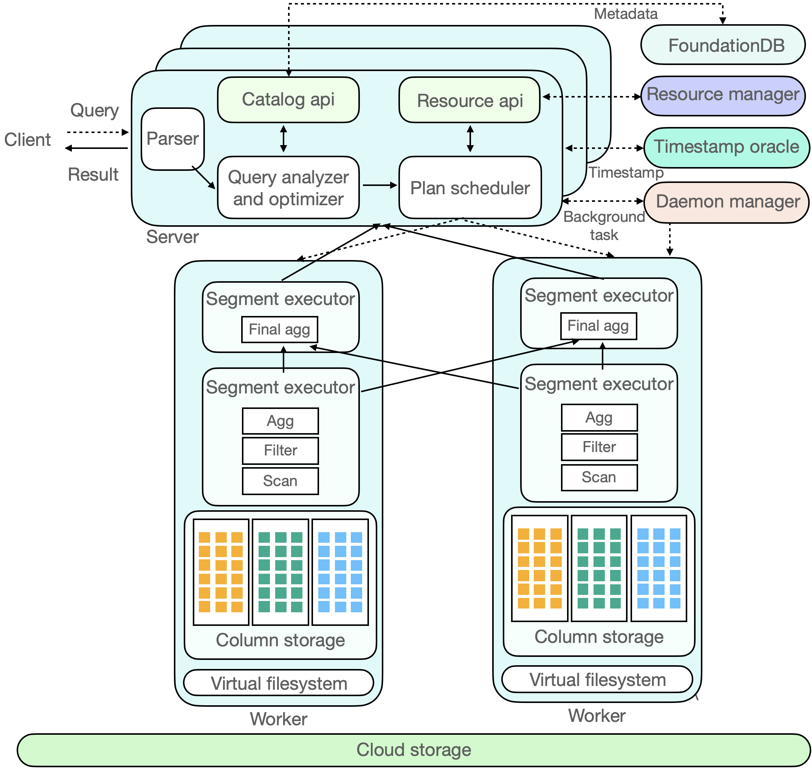

# ByConity

<p align="center">
    
</p>

ByConity is a data warehouse designed for changes in modern cloud architecture. It adopts a cloud-native architecture design to meet the requirements of data warehouse users for flexible scaling, separation of reads and writes, resource isolation, and strong data consistency. At the same time, it provides excellent query and write performance. 

ByConity is using a large number of mature OLAP technologies, such as column storage engine, MPP execution, intelligent query optimization, vectorized execution, Codegen, indexing, and data compression; it also makes special technological innovations for the cloud scenarios and storage-computing separation architecture.

ByConity is built on top of [ClickHouse](https://github.com/ClickHouse/ClickHouse). We appreciate the excellent work of the ClickHouse team.

## Build ByConity
The easiest way to build ByConity is built in [docker](https://github.com/ByConity/ByConity/tree/master/docker/builder)

It can also be built the following operating systems:

- Linux

### 1. Prepare Prerequisites

The following packages are required:

- Git
- CMake 3.17 or newer
- Ninja
- C++ compiler: clang-11 or clang-12
- Linker: lld

```
sudo apt-get update
sudo apt-get install git cmake ccache python3 ninja-build libssl-dev

# install llvm 12
sudo apt install lsb-release wget software-properties-common gnupg # pre-requisites of llvm.sh
wget https://apt.llvm.org/llvm.sh
chmod +x llvm.sh
sudo ./llvm.sh 12
```

### 2. Checkout Source Code

```
git clone --recursive https://github.com/ByConity/ByConity.git byconity
```

### 3. Build

```
cd byconity
mkdir build && cd build
export CC=clang-12
export CXX=clang++-12
cmake ..
ninja
```

Then you can find the binary in the programs folder

```
clickhouse-client    # byconity client
clickhouse-server    # byconity server
clickhouse-worker    # byconity worker
tso_server           # byconity tso
daemon_manager       # byconity daemon manager
resource_manager     # byconity resource manager
```

## Try ByConity

A minimal ByConity cluster include:
- A [FoundationDB](https://www.foundationdb.org/) database cluster to store meta data.
- A [HDFS](https://hadoop.apache.org/docs/r1.2.1/hdfs_design.html) cluster to store data.
- A ByConity server to receive request from clients.
- A ByConity read worker to carry execution of read requests forward from server.
- A ByConity write worker to carry execution of write requests forward from server.
- A ByConity TSO server to provide timestamp
- A ByConity daemon manager to manage background jobs that run in server

We have packed all the setup step inside this docker-compose [file](https://github.com/ByConity/byconity-docker) so you can bring up a test cluster within few commands.
