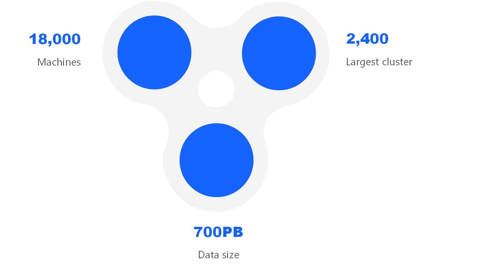
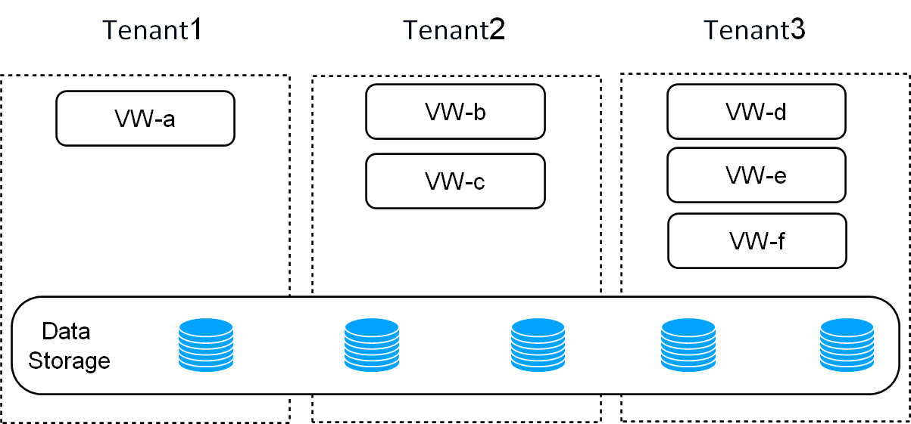
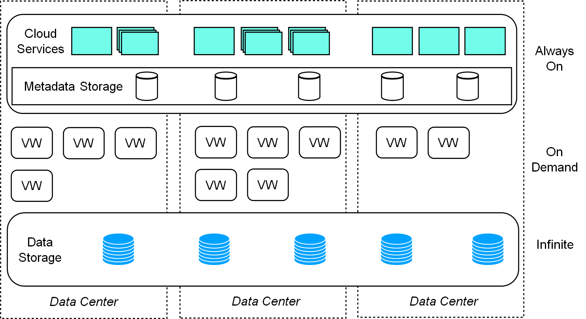

# ByConity: An Open source Cloud-native Data Warehouse

## Introduction to ByConity

ByConity is an open-source cloud-native data warehouse that adopts a storage-computing separation architecture. It supports several key features, including separation of storage and computing, elastic expansion and contraction, isolation of tenant resources, and strong consistency of data read and write. By utilizing mainstream OLAP engine optimizations, such as column storage, vectorized execution, MPP execution, query optimization, etc., ByConity can provide excellent read and write performance.

## ByConity's History

The background of ByConity can be traced back to 2018 when ByteDance began to use ClickHouse internally. Due to the development of business, the scale of data has become larger and larger to serve a large number of users. However, because ClickHouse is a Shared-Nothing architecture, each node is independent and does not share storage resources, so computing resources and storage resources are tightly coupled. This leads to a higher cost of expansion and contraction, and involves data migration, which prevents real-time and on-demand expansion and contraction, resulting in a waste of resources. Furthermore, the tightly coupled architecture of ClickHouse will cause multi-tenants to interact with each other in the shared cluster. In addition, because reading and writing are completed on one node, reading and writing are affected. Finally, ClickHouse does not support performance in complex queries such as multi-table join. Based on these pain points, the ByConity project was launched in January 2020. 

The ByConity team hopes to give the project back to the community and improve it through the power of open source. In January 2023, ByConity was officially open-sourced, and the beta version was released.

Figure 1: ByteDance ClickHouse Usage

# Features of ByConity

ByConity has several key features that make it a powerful open-source cloud-native data warehouse.

## Storage-Computing Separation

One of the critical advantages of ByConity is its storage-computing separation architecture, which enables read-write separation and elastic scaling. This architecture ensures that read and write operations do not affect each other, and computing resources and storage resources can be independently expanded and contracted on demand, ensuring efficient resource utilization. ByConity also supports multi-tenant resource isolation, making it suitable for multi-tenant environments.

Figure 2: ByConity storage-computing separation to achieve multi-tenant isolation

## Elastic Scaling

ByConity supports flexible expansion and contraction, enabling real-time and on-demand expansion and contraction of computing resources, ensuring efficient use of resources.

## Resource Isolation

ByConity isolates the resources of different tenants, ensuring that tenants are not affected by each other.

## Strong Data Consistency

ByConity ensures strong consistency of data read and write, ensuring that data is always up to date with no inconsistencies between reads and writes.

## High Performance

ByConity adopts mainstream OLAP engine optimizations, such as column storage, vectorized execution, MPP execution, query optimization, etc., ensuring excellent read and write performance.

# ByConity's Technical Architecture

ByConity's architecture is divided into three layers:

1. Service access layer: Responsible for client data and service access, i.e., ByConity Server
2. Computing group: ByConity's computing resource layer, where each Virtual Warehouse is a computing group
3. Data storage: Distributed file system, such as HDFS, S3, etc. 

Figure 3: ByConity's architecture

# Working Principle of ByConity

ByConity is a powerful open-source cloud-native data warehouse that adopts a storage-computing separation architecture. In this section, we will examine the working principle of ByConity and the interaction process of each component of ByConity through the complete life cycle of a SQL.

Figure 4: ByConity internal component interaction diagram

Figure 4 above is the interaction diagram of ByConity components. The dotted line in the figure indicates the inflow of a SQL, the two-way arrow in the solid line indicates the interaction within the component, and the one-way arrow indicates the data processing and output to the client.

ByConity's working principle can be divided into three stages:

## Stage 1: Query Request

The client submits a query request to the server, and the server first performs parsing, then analyzes and optimizes through analyzer and optimizer to generate a more efficient executable plan. Here, metadata MetaData is read, which is stored in a distributed KV. ByConity uses FoundationDB and reads the metadata through the Catalog.

## Stage 2: Plan Scheduling

ByConity submits the executable plan generated by the analysis and optimizer to the scheduler (Plan Scheduler). The scheduler obtains idle computing resources by accessing the resource manager and decides which nodes to schedule query tasks for execution.

## Stage 3: Query Execution

Query requests are finally executed on ByConity's Worker, and the Worker will read data from the lowest-level Cloud storage and perform calculations by establishing a pipeline. Finally, the calculation results of multiple workers are aggregated by the server and returned to the client.

In addition to the above components, ByConity also has two main components, Time-stamp Oracle and Deamon Manager. The former ByConity supports transaction processing, and the latter manages and schedules some subsequent tasks.

# Main Component Library

To better understand the working principle of ByConity, let's take a look at the main components of ByConity:

## Metadata Management

ByConity provides a highly available and high-performance metadata read and write service - Catalog Server. And ByConity supports complete transaction semantics (ACID). At the same time, we have made a better abstraction of the Catalog Server, making the back-end storage system pluggable. Currently, we support Apple's open-source FoundationDB, which can be expanded to support more back-end storage systems later.

## Query Optimizer

The query optimizer is one of the cores of the database system. A good optimizer can greatly improve query performance. ByConity's self-developed optimizer improves optimization capabilities based on two directions:

- RBO: Rule-Based Optimization capability. Support: column pruning, partition pruning, expression simplification, subquery disassociation, predicate pushdown, redundant operator elimination, outer-JOIN to INNER-JOIN, operator pushdown storage, distributed operator splitting, etc.
- CBO: Cost-Based Optimization capability. Support: Join Reorder, Outer-Join Reorder, Join/Agg Reorder, CTE, Materialized View, Dynamic Filter Push-Down, Magic Set, and other cost-based optimization capabilities. And integrate Property Enforcement for distributed planning.

## Query Scheduling

ByConity currently supports two query scheduling strategies: Cache-aware scheduling and Resource-aware scheduling.

- The cache-aware scheduling policy is aimed at scenarios where storage and computing are separated, aiming to maximize the use of the cache and avoid cold reads. The cache-aware scheduling strategy will try to schedule tasks to nodes with corresponding data caches, so that calculations can hit the cache and improve read and write performance.
- Resource-aware scheduling perceives the resource usage of different nodes in the computing group in the entire cluster and performs targeted scheduling to maximize resource utilization. At the same time, it also performs flow control to ensure reasonable use of resources and avoid negative effects caused by overload, such as system downtime.

## Computing Group

ByConity supports different tenants to use different computing resources. Under ByConity's new architecture, it is easy to implement features such as multi-tenant isolation and read-write separation. Different tenants can use different computing groups to achieve multi-tenant isolation and support read-write separation. Due to the convenient expansion and contraction, the computing group can be dynamically expanded and contracted on demand to ensure efficient resource utilization. When resource utilization is not high, resource sharing can be carried out, and computing groups can be seconded to other tenants to maximize resource utilization and reduce costs.

## Virtual File System

The virtual file system module is used as the middle layer of data reading and writing. ByConity has made a better package, exposing storage as a service to other modules to realize "storage as a service". The virtual file system provides a unified file system abstraction, shields different back-end implementations, facilitates expansion, and supports multiple storage systems, such as HDFS or object storage.

## Cache Acceleration

ByConity performs query acceleration through caching. Under the architecture of separating storage and computing, ByConity performs cache acceleration in both metadata and data dimensions. In the metadata dimension, by caching in the memory of ByConity's Server side, table, and partition are used as granularity. In the data dimension, ByConity's Worker side, that is, the computing group, is used for caching, and the cache on the Worker side is hierarchical. At the same time, memory and disk are used, and the mark set is used as the cache granularity, thereby effectively improving the query speed.

## How to Obtain and Deploy

ByConity currently supports four acquisition and deployment modes. Community developers are welcome to use them and submit issues to us:
- Stand-alone version
   - Use docker compose to pull up Reference: https://github.com/ByConity/byconity-docker
- K8s cluster version mode
   - Use K8s deployment reference: https://github.com/ByConity/byconity-deploy
- Physical machine deployment mode
   - Deploy on a physical machine using the package manager: https://github.com/ByConity/ByConity/tree/master/packages
- Source code compilation method
   - Reference: https://github.com/ByConity/ByConity#build-byconity

## ByConity's Future Open-Source Plan

ByConity includes several key milestones in its open-source community roadmap through 2023. These milestones are designed to enhance ByConity's functionality, performance, and ease of use. Among them, the development of new storage engines, support for more data types, and integration with other data management tools are some important areas of focus. We have listed the following directions, and we have created an issue on Github: https://github.com/ByConity/ByConity/issues/26, inviting community partners to join us to discuss co-construction:
- In terms of performance improvement: ByConity hopes to continue to improve performance, and here are three technical directions. One is to use indexes for acceleration, which includes four aspects:
   - Optimize the existing skip index;
   - Explore the implementation of new index research, such as zorder-index and inverted index;
   - ByConity builds and accelerates Hive table indexes
   - Index recommendation and conversion, lowering the threshold for users to use
   The second is the continuous optimization of the query optimizer; the third is that ByConity's cache mechanism is local, and each computing group can only access its own cache. In the future, it is hoped to implement a distributed cache mechanism to further improve the cache hit rate.
- Stability improvement: There are two aspects here. One is to support resource isolation in more dimensions. Currently, it only supports resource isolation in the computing group dimension. In the next step, resource isolation will also be supported on the server side, providing better end-to-end Guaranteed multi-tenancy capability. The second direction is to enrich metrics and improve observability and problem diagnosis capabilities.
- Enterprise-level feature enhancements: We hope to achieve more detailed permission control, including column-level permission control. The other is to improve the functions related to data security, such as data backup and recovery and data end-to-end encryption. Finally, we continue to explore the deep compression of data to save storage costs.
- Ecological compatibility improvement: This direction is the most important point. ByConity plans to support more types of storage backends, such as AWS's S3, Volcano Engine's object storage, etc. In terms of improving ecological compatibility, it includes integration with some drivers and some open source software. At the same time, we also hope to support federated queries of data lakes, such as Hudi, Iceberg, etc.

In short, ByConity is an open source cloud-native data warehouse that provides read-write separation, elastic expansion and contraction, tenant resource isolation, and strong consistency of data read and write. Its storage-computing separation architecture, combined with mainstream OLAP engine optimization, ensures excellent read and write performance. As ByConity continues to develop and improve, it is expected to become an important tool for cloud-native data warehouses in the future.

We have a video that introduces ByConity in detail, including a demo of ByConity. If you need more information, you can check the following link: https://www.bilibili.com/video/BV15k4y1b7pw/?spm_id_from=333.999.0.0&vd_source=71f3be2102fec1a0171b49a530cefad0

Scan the QR code to reply [name + QR code] Join the ByConity communication group to get more project dynamics and activity information.

ByConity Community QR Code

