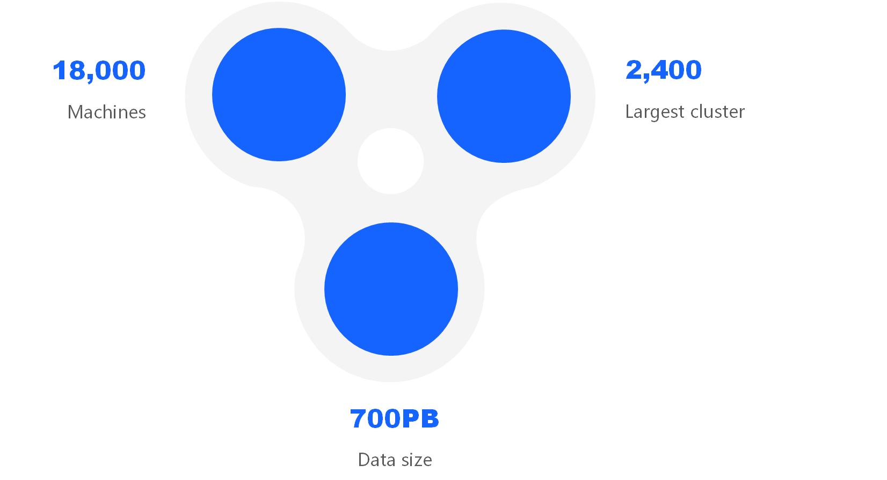
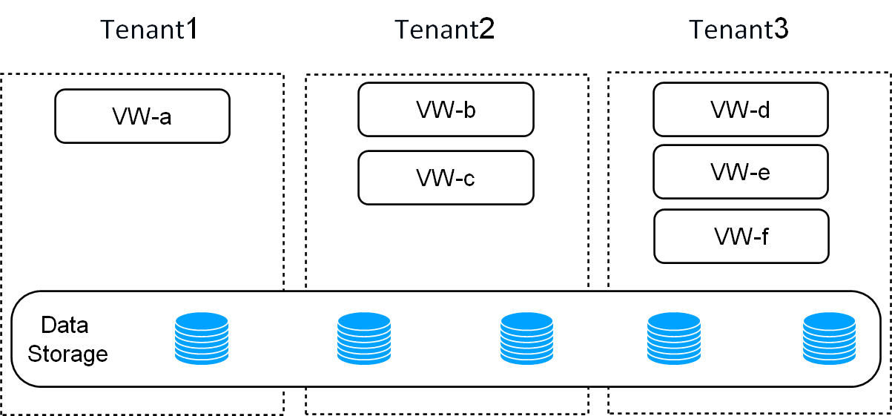
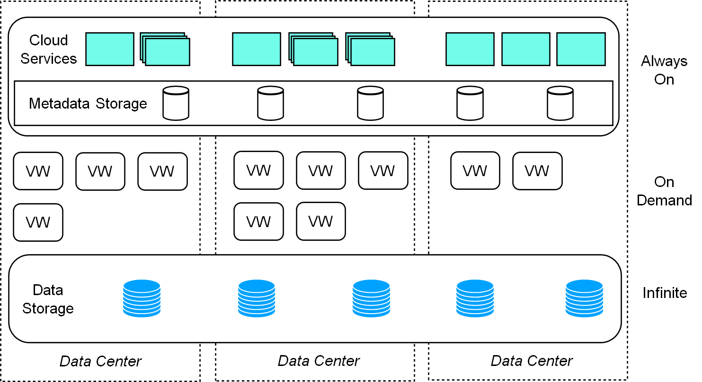
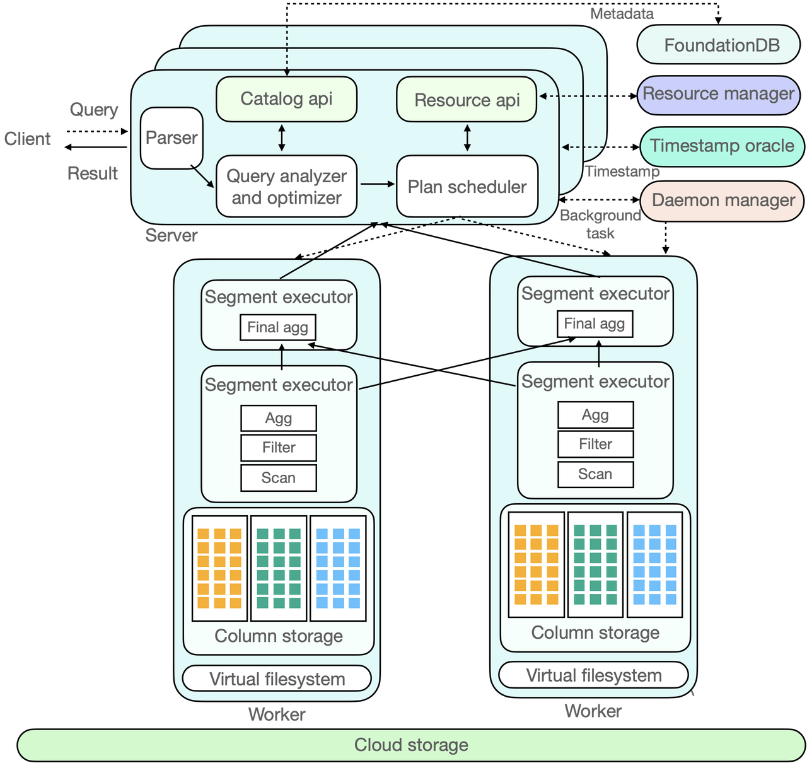

# Introduction to ByConity

ByConity is an open-source cloud-native data warehouse developed by ByteDance. It utilizes a computing-storage separation architecture and offers various essential features, including the separation of computing and storage, elastic scalability, tenant resource isolation, and strong consistency in data reading and writing. By leveraging optimizations from popular OLAP engines like column storage, vectorized execution, MPP execution, and query optimization, ByConity delivers exceptional read and write performance.

# History of ByConity

The origins of ByConity can be traced back to 2018 when ByteDance initially implemented ClickHouse for internal use. As the business grew, the data volume increased significantly to cater to a large user base. However, ClickHouse's Shared-Nothing architecture, where each node operates independently without sharing storage resources, posed certain challenges during its usage. Here are some of the issues encountered:

## Expansion and contraction: 
Due to the tight coupling of computing and storage resources in ClickHouse, scaling the system incurred higher costs and involved data migration. This prevented real-time on-demand scalability, resulting in inefficient resource utilization.

## Multi-tenancy and shared cluster environment:
ClickHouse's tightly coupled architecture led to interactions among multiple tenants in a shared cluster environment. Since reading and writing operations were performed on the same node, they often interfered with each other, impacting overall performance.

## Performance limitations: 
ClickHouse's support for complex queries, such as multi-table join operations, was not optimal, which hindered the system's ability to handle such queries efficiently.

To address these pain points, ByteDance undertook an architectural upgrade of ClickHouse. In 2020, we initiated the ByConity project internally. After releasing the Beta version in January 2023, the project was officially made available to the public at the end of May 2023.

Figure 1: ByteDance ClickHouse Usage

# Features of ByConity

ByConity implements a computing and storage separation architecture that transforms the original local management of computing and storage on individual nodes. Instead, it adopts a unified management approach for all data across the entire cluster using distributed storage. This transformation results in stateless computing nodes, enabling dynamic expansion and contraction by leveraging the scalability of distributed storage and the stateless nature of computing nodes. ByConity offers several crucial features that enhance its functionality and performance:

## Storage-Computing Separation

One of the critical advantages of ByConity is its storage-computing separation architecture, which enables read-write separation and elastic scaling. This architecture ensures that read and write operations do not affect each other, and computing resources and storage resources can be independently expanded and contracted on demand, ensuring efficient resource utilization. ByConity also supports multi-tenant resource isolation, making it suitable for multi-tenant environments.

Figure 2: ByConity storage-computing separation to achieve multi-tenant isolation

## Resource Isolation

ByConity provides resource isolation, ensuring that different tenants have separate and independent resources. This prevents interference or impact between tenants, promoting data privacy and efficient multi-tenancy support.

## Elastic Scaling

 ByConity supports elastic expansion and contraction, allowing for real-time and on-demand scaling of computing resources. This flexibility ensures efficient resource utilization and enables the system to adapt to changing workload requirements.
 
## Strong Data Consistency

ByConity ensures strong consistency of data read and write operations. This ensures that data is always up-to-date and eliminates any inconsistencies between read and write operations, guaranteeing data integrity and accuracy.

## High Performance

ByConity incorporates optimization techniques from mainstream OLAP engines, such as column storage, vectorized execution, MPP execution, and query optimization. These optimizations enhance read and write performance, enabling faster and more efficient data processing and analysis.

# Technical Architecture of ByConity
ByConity follows a three-layer architecture consisting of:
1. Service access layer: The service access layer, represented by ByConity Server, handles client data and service access. 
2. Computing layer: The computing layer comprises multiple computing groups, where each Virtual Warehouse (VW) functions as a computing group.  
3. Data storage layer: The data storage layer utilizes distributed file systems like HDFS and S3.

Figure 3: ByConity's architecture

# Working Principle of ByConity

ByConity is a powerful open-source cloud-native data warehouse that adopts a storage-computing separation architecture. In this section, we will examine the working principle of ByConity and the interaction process of each component of ByConity through the complete life cycle of a SQL.

Figure 4: ByConity internal component interaction diagram

Figure 4 depicts the interaction diagram of ByConity's components. In the figure, the dotted line represents the inflow of a SQL query, the double-headed arrow indicates component interaction, and the one-way arrow represents data processing and output to the client. Let's explore the interaction process of each component in ByConity throughout the complete lifecycle of a SQL query.

ByConity's working principle can be divided into three stages:

## Stage 1: Query Request

The client submits a Query request to the server. The server initially performs **parsing** and subsequently analyzes and optimizes the query through the **Query Analyzer and Optimizer** to generate an efficient executable plan. To access the required **metadata**, which is stored in a distributed key-value (KV) store, ByConity leverages **FoundationDB** and reads the metadata from the **Catalog**.

## Stage 2: Plan Scheduling

ByConity passes the optimized executable plan to the **Plan Scheduler** component. The scheduler accesses the **Resource Manager** to obtain available computing resources and determines which nodes to schedule the query tasks for execution.

## Stage 3: Query Execution

The Query request is executed on **ByConity's Workers**. The Workers read data from the underlying **Cloud Storage** and perform computations by establishing a Pipeline. The server then aggregates the calculation results from multiple Workers and returns them to the client.

Additionally, ByConity includes two main components: **Time-stamp Oracle** and **Daemon Manager**. The time-stamp oracle supports transaction processing, while the daemon manager manages and schedules subsequent tasks.

## Main Component Library

To better understand the working principle of ByConity, let's take a look at the main components of ByConity:

### Metadata Management

ByConity offers a highly available and high-performance metadata read and write service called the Catalog Server. It supports complete transaction semantics (ACID). Furthermore, we have designed the Catalog Server with a flexible architecture, allowing for the pluggability of backend storage systems. Currently, we support Apple's open-source FoundationDB, and there is potential for extending support to other backend storage systems in the future.

### Query Optimizer

The query optimizer plays a crucial role in the performance of a database system. A well-designed optimizer can significantly enhance query performance, particularly in complex query scenarios, where it can achieve performance improvements ranging from several times to hundreds of times. ByConity's self-developed optimizer focuses on improving optimization capabilities through two main approaches:
- RBO (Rule-Based Optimization): This capability encompasses various optimizations such as column pruning, partition pruning, expression simplification, subquery dissociation, predicate pushdown, redundant operator elimination, Outer-Join to Inner-Join conversion, operator pushdown storage, distributed operator splitting, and other heuristic optimization techniques.
- CBO (Cost-Based Optimization): ByConity's optimizer also includes cost-based optimization capabilities. This includes support for join reorder, outer-join reorder, join/agg reorder, common table expressions (CTE), materialized views, dynamic filter push-down, magic set optimization, and other cost-based techniques. Additionally, it integrates property enforcement for distributed planning.

### Query Scheduling

ByConity currently supports two query scheduling strategies: Cache-aware scheduling and Resource-aware scheduling.

- The **cache-aware scheduling** focuses on scenarios where computing and storage are separated. Its objective is to maximize cache utilization and minimize cold reads. This strategy aims to schedule tasks to nodes that have corresponding data caches, enabling computations to leverage the cache and improve read and write performance. Additionally, considering the dynamic expansion and contraction of the system, cache-aware scheduling strives to minimize the impact of cache failure on query performance when the computing group's topology changes.
- **Resource-aware scheduling** analyzes the resource usage of different nodes within the computing group across the entire cluster. It performs targeted scheduling to optimize resource utilization. Moreover, resource-aware scheduling incorporates flow control mechanisms to ensure rational resource utilization and prevent negative effects caused by overload, such as system downtime.

### Computing Group

ByConity enables different tenants to utilize distinct computing resources, as depicted in Figure 5. With ByConity's architecture, implementing features like multi-tenant isolation and read-write separation becomes straightforward. Each tenant can leverage separate computing groups to achieve multi-tenant isolation and support read-write separation. The computing groups can be dynamically expanded and contracted on-demand, ensuring efficient resource utilization. During periods of low resource utilization, resource sharing can be employed, allowing computing groups to be allocated to other tenants to maximize resource utilization and minimize costs.

### Virtual File System

The virtual file system module serves as an intermediary layer for data reading and writing. ByConity has optimized this module to provide a "storage as a service" capability to other modules. The virtual file system offers a unified file system abstraction, shielding the underlying different back-end implementations. It facilitates easy expansion and supports multiple storage systems, such as HDFS or object storage.

### Cache Acceleration

ByConity utilizes caching to accelerate query processing. Under the computing-storage separation architecture, cache acceleration is performed in both the metadata and data dimensions. In the metadata dimension, ByConity caches Table and Partition information in the memory of the server-side (ByConity Server). In the data dimension, cache acceleration occurs on the Worker side within the computing group. This hierarchical caching mechanism utilizes both memory and disk, with Mark collection serving as the cache granularity. These caching strategies effectively enhance query speed and performance.

# How to Deploy Byconity

ByConity currently supports four acquisition and deployment modes. Community developers are welcome to use them and submit issues to us:
- Stand-alone Docker: ByConity provides a Docker deployment option, which can be accessed at https://github.com/ByConity/byconity-docker
- K8s cluster deployment: ByConity also supports deployment on Kubernetes clusters. The deployment guide for Kubernetes can be found at https://github.com/ByConity/byconity-deploy
- Physical machine deployment: If you prefer to deploy ByConity on physical machines, you can refer to the repository at https://github.com/ByConity/ByConity/tree/master/packages
- Source code compilation: You can compile the ByConity source code yourself. The source code repository can be accessed at https://github.com/ByConity/ByConity#build-byconity

# ByConity's Future Open-Source Plan

ByConity includes several key milestones in its open-source community roadmap through 2023. These milestones are designed to enhance ByConity's functionality, performance, and ease of use. Among them, the development of new storage engines, support for more data types, and integration with other data management tools are some important areas of focus. We have listed the following directions, and created an issue on Github: https://github.com/ByConity/ByConity/issues/26, inviting the community to join us to discuss co-development:

- **Performance improvement**: ByConity aims to boost performance through various optimizations. This includes leveraging indexes for acceleration, such as Skip-index optimization, support for new Zorder-index and inverted indexes. ByConity will also focus on the construction and acceleration of external indexes, as well as the automatic recommendation and conversion of indexes. Continuous enhancements to the query optimizer and the implementation of a distributed caching mechanism are also part of the performance improvement efforts.
- **Stability improvement**: There are two aspects here.
  - One is to support resource isolation in more dimensions. ByConity is committed to improving stability by extending resource isolation capabilities in multiple dimensions, thereby providing better multi-tenant support. 
  - The second direction is to enrich metrics and improve observability and problem diagnosis capabilities, ensuring a stable and reliable experience for users.
- **Enterprise-level feature enhancements**: ByConity aims to introduce finer-grained authority control, improve data security-related functions such as backup, recovery, and data encryption and continue to explore techniques for deep compression of data to save storage costs.
- **Ecosystem compatibility improvement**: ByConity plans to expand its compatibility with various storage systems, including popular object storage solutions like S3 and TOS. It plans to enhance the overall compatibility and integration capabilities, facilitating seamless integration with other tools and frameworks. Moreover, it aims to support data lake federation queries, enabling interaction with technologies like Hudi, Iceberg, and more.

# Working with the Community

Since the release of the Beta version, ByConity has received support from numerous enterprise developers, including Huawei, Electronic Cloud, Zhanxinzhanli, Tianyi Cloud, Vipshop, and Transsion Holdings. These organizations have actively contributed by deploying ByConity in their respective environments, undergoing TPC-DS verification, and conducting tests in their business scenarios. The results have been promising, and their feedback has provided valuable insights for improvement, which we greatly appreciate.

We are delighted to receive the ideas and willingness of community partners to build together. We have already initiated joint development efforts with Huawei Terminal Cloud. Our collaborative endeavors will focus on various areas, such as Kerberos authentication, ORC support, and integration with S3 storage. 

If you are interested in joining our community and participating in the development of ByConity, we invite you to visit our GitHub repository at https://github.com/ByConity/ByConity. You can find more information and details about our ongoing projects, contribute your ideas, and collaborate with us to further enhance ByConity. To get involved, simply scan the QR code provided below to join our [Discord](https://discord.gg/V4BvTWGEQJ) or follow us on [Twitter](https://twitter.com/ByConity). 

ByConity Discord Group

ByConity Twitter

# Summary

In summary, ByConity is an open source cloud-native data warehouse that offers features such as read-write separation, elastic expansion and contraction, tenant resource isolation, and strong data read and write consistency. It utilizes a computing-storage separation architecture and leverages optimizations from mainstream OLAP engines to deliver excellent read and write performance. As ByConity continues to evolve and improve, it aims to become a key tool for cloud-native data warehousing in the future.
