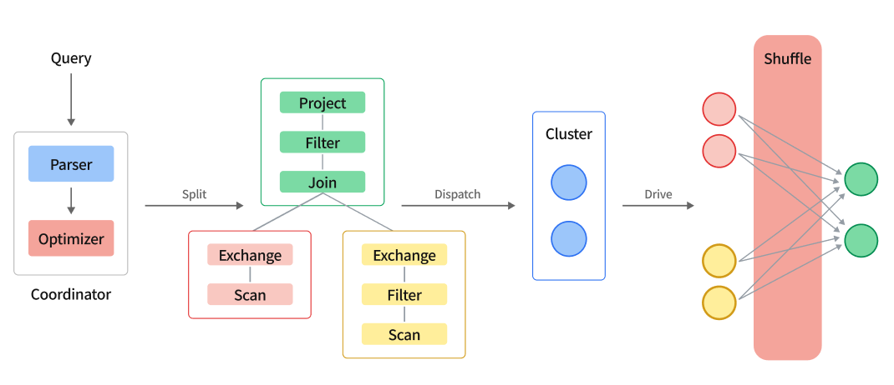

# Complex query model and execution tuning

## Complex query execution model

**Complex query execution model diagram**

Analytical queries can be classified into simple and complex queries. Simple queries typically involve retrieving and aggregating data from a single table, as well as joining large and small tables, with fast query response times. Complex queries, on the other hand, involve large tables, multiple table associations, and complex logic processing, often with slow query response times and high resource consumption. ByConity is optimized for complex queries.

For simple queries, a two-stage execution model is used, with the partial stage executed on the computing node and the final stage executed on the service node. However, when executing complex queries involving multiple aggregations or joins, the flexibility of the two-stage execution model is limited, making query optimization challenging. To better support distributed queries and facilitate the execution of the execution plan generated by the optimizer, we have introduced complex queries that support multiple rounds of distributed execution mode.

The execution flow of a complex query is as follows:

- Query SQL String is parsed into AST by parser
- Rewrite and optimize AST to generate an execution plan
- When the optimizer is enabled, an execution plan is generated by the optimizer.
- Divide the execution plan into multiple PlanSegments
- PlanSegment is an execution segment in the distributed execution process, which contains
- The AST fragment required for execution, or a logical execution plan fragment composed of PlanNode
- Node information for PlanSegment execution
- The upstream and downstream information of PlanSegment, which includes the upstream input flow and the input flow required by the downstream
- The engine's scheduler will form these PlanSegments into a DAG, and then distribute them to all nodes in the cluster according to topological sorting
- After each node receives the PlanSegment, it starts to drive the execution of the PlanSegment
- The PlanSegment containing the data source starts to read the data, and distributes the data to the downstream nodes according to certain shuffle rules
- The PlanSegment containing the exchange input waits for upstream data, and if it needs to continue to shuffle, it will continue to send the data to each node
- After multiple rounds of stages are completed, the results will be returned to the server

## How to enable it

Enabling the optimizer will automatically follow the complex query execution model. It can be enabled by configuring enable_optimizer=1, or dialect_type='ANSI'.

- Make sure statistics exist

Without statistics, the resulting query plan is suboptimal. `show stats [<db_name>.]<table_name>`

- Analyze the time spent on each Step of the plan

The time-consuming of each Step can be displayed by `explain analyze sql`

- Exchange parameter tuning

Exchange operators are responsible for data transfer between PlanSegments.

`exchange_source_pipeline_threads` affects the total number of threads executed by the pipeline, especially for non-source pipelines (referring to pipelines that directly read data from storage). Currently, the default setting is the number of CPU cores. There is currently no ideal recommended value. You can consider /2 or \ *2 Observation results. If the query memory usage is large, it can be adjusted down.

`exchange_timeout_ms` Exchange timeout time (ms), the default is 100s, if there is an Exchange-related timeout error, you can increase it appropriately

`exchange_unordered_output_parallel_size` affects the concurrency of exchange output data, the default is 8, and generally does not need to be adjusted. If the adjustment of exchange_source_pipeline_threads is relatively large, you can appropriately increase exchange_unordered_output_parallel_size to increase the upstream output capacity.

`exchange_enable_block_compress` Whether to enable exchange compression, it is enabled by default, if the CPU bottleneck is more obvious than the network, you can try to turn it off

## Reference Documentation
