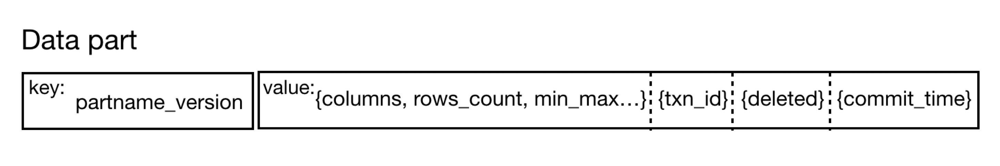

# Transactions and concurrency control

### Transaction overview

In ByConity (formerly codenamed CNCH), support for transaction semantics is provided to ensure data quality. Each SQL statement is converted into a transaction for execution. Transactions provide the guarantee of atomicity, consistency, isolation, and durability (ACID) properties and are designed to be used in various situations such as concurrent read and write, software exceptions, and hardware exceptions. This ensures that the correctness and integrity of the data can still be guaranteed even in the face of such situations.

- Atomicity ensures that each transaction is treated as a unit, and the transaction either succeeds completely or fails completely. Before the transaction is successful, the written data is not visible, and there will be no situation where only part of the data is visible. After the transaction fails, some of the written data will be automatically cleaned up, so that no garbage data remains. ByConity guarantees atomicity in various situations, including various exceptions such as power failure, error, and downtime.
- Consistency ensures that the database will only change from one valid state to another valid state, and any data writing must follow the defined rules.
- Isolation ensures the correctness of concurrent execution of database SQL (for example, reading and writing the same table at the same time), and ensures that the state of the database can be equivalent to a state of sequential execution in a concurrent scenario, and transactions do not interfere with each other. Isolation is the goal of concurrency control, and there can be multiple isolation levels. ByConity provides users with support for the read committed (RC) isolation level. Writes by outstanding transactions are invisible to other transactions.
- Durability ensures high availability of data. Once the transaction is successfully committed, the written data will be persisted, even if various system failures occur, it will not be lost. The storage and computing separation structure adopted by ByConity uses a mature highly available distributed file system or object storage (such as HDFS, S3) to ensure high availability of data submitted by successful transactions.

### Metadata storage selection

ByConity is an analytical database (OLAP) that has different transaction requirements from traditional relational databases (OLTP). Analytical transaction requirements focus on high-throughput and low-latency scenarios, whereas OLTP databases prioritize high-QPS real-time scenarios.

In addition to the basic ACID properties that need to be guaranteed, ByConity has three special requirements for transaction implementation selection. Firstly, a single transaction in ByConity may involve massive amounts of data (e.g., hundreds of millions of rows), with high requirements for data throughput and write performance, and its atomicity needs to be guaranteed. Secondly, the proportion of reads in the analytical database workload is higher than that of writes, so transactions need to ensure that the read workload is not affected or blocked by the write workload. Finally, transactions need to have flexible and controllable concurrency control functions. In addition to processing user-side concurrent workloads, ByConity also needs to handle concurrent background tasks.

ByConity's transaction processing mainly manages the metadata of user data. The metadata includes the user's database metadata (db), table metadata (data table), and part metadata (part is the metadata of the data file, including the part name, columns, number of rows, status, version, submission time, etc.). As the data grows, the metadata itself will also grow linearly in magnitude and cannot be lost, requiring a highly available distributed storage or distributed database solution. ByConity uses a mature distributed key-value database as the storage solution for metadata. Through the abstract metadata read and write API, the backend is adapted to FoundationDB developed by Apple.

### Distributed Clocks

The execution of transactions in a distributed system requires clock synchronization among different distributed nodes. ByConity adopts a simple and practical solution called Timestamp Oracle (TSO). Its advantages are its simplicity and ease of understanding, and the central time service can be used to determine a unique time. It also has good performance, with a single TSO node supporting over 1 million QPS. The disadvantage is that it is not suitable for cross-data center scenarios, and the time delay of obtaining TSO for all transactions is relatively high. Since TSO is a centralized timing solution, ByConity provides high availability services for it.

TSO utilizes a mixed logical clock, where the clock consists of a physical part and a logical part, and 64 bits represent a time. To avoid the loss of timestamps caused by TSO downtime, the timestamps need to be persisted. However, if the timing is persisted every time, performance will be reduced. Thus, TSO pre-applies for an allocatable time window (e.g., 3 seconds). After the application is successful, TSO can directly allocate all timestamps within the 3-second window in memory. When a client requests a timestamp, the logical clock part is incremented with the request. If there is an overflow in the logical part, it will sleep for 50ms and wait for the physical clock to be advanced. TSO checks the clock every 50ms. If the physical clock of the current TSO is behind the current time, the physical clock part of the TSO needs to be updated to the current physical time. If the logical clock is more than half, the physical clock of TSO will also be increased. Once the physical clock increases, the logical clock will be cleared. If the current time window has been used up, the next time window needs to be applied for. At the same time, the upper bound of the persistent window is updated.


### Transaction Processing

- Atomicity

ByConity's single transaction has high-throughput read and write requirements for metadata management. Since distributed key-value databases (such as FoundationDB) have a size limit (such as 10MB) for the value of a single atomic write, ByConity implements a two-stage approach for its distributed key-value storage to make the size of a single write unlimited and more flexible and controllable. In the first stage, arbitrary data can be written multiple times in batches and is invisible. In the second stage, the transaction is committed, and all written data is visible at the same time after the commit is successful. The following example describes a detailed process of the 2-stage atomic commit using an insert SQL statement.

- Phase 1
- 1. a: Write a transaction record (txn record) in kv to uniquely identify the current transaction;
- 1. b: parse and execute insert sql;
- 1. c: Before writing data to the remote file system or object storage, first write the location information of the data to be written into the undo buffer (for cleaning in case of failure);
- 1. d: Write data to remote file system or object storage;
- 1. e: The metadata part of the submitted data is written into kv;
- Phase 2
- Submit the transaction and update the submission time of the transaction record;
- The commit time of asynchronously updating part data is the commit time of the transaction (before the commit time of part is not updated, it is necessary to check the commit time of the transaction record);


```
                                                        Transaction submission detailed flow chart
```

- Consistency

The distributed key-value storage system chosen by ByConity, ByteKV and Foundation have provided consistent support, and can be reused directly.

- Isolation

ByConity provides support for the Read Committed (RC) isolation level for users. When each transaction is initialized, it obtains a timestamp (timestamp) from the TSO service as its ID and start time. When the transaction is submitted, it obtains a submission time from the TSO service and updates the submission time of the transaction record in KV. It also asynchronously updates the submission time of the part. The read transaction can read the part metadata information that has been successfully committed (i.e., the corresponding transaction has committed successfully) and the commit time is less than the start time of the read transaction, thus realizing the RC semantics. The RC isolation level maximizes read performance compared to stricter isolation levels. With stricter isolation levels such as Serializable Snapshot Isolation (SSI), reads may be blocked by writes.

- Durability

ByConity metadata is persisted to FoundationDB, and the characteristics of distributed Key-value storage provide the guarantee of persistence and high availability.

### Concurrency Control

ByConity uses multiple versions and locks to ensure the correctness of data in concurrent read and write scenarios. In addition to user workloads, ByConity also has background tasks (such as merge/alter tasks and unique key table deduplication tasks) that require concurrent reading and writing. ByConity has chosen the RC isolation level, which allows new writes (such as inserts) to be executed lock-free because they are invisible. However, for existing data, concurrency control is required when reading and writing concurrently.

#### Multiple versions

In addition to its original basic information, the metadata of each part has a corresponding version (version). Every time the existing data is changed, a new version will be generated instead of directly updating the original data. . For the RC isolation level, the read transaction that has already started continues to read the old version, and the new version is invisible to it, so that reading and writing do not affect each other, maximizing read and write performance.



#### Lock

- Distributed KV lock

ByConity provides a global KV exclusive lock for DDL to avoid concurrent changes to the table schema. Distributed KV locks are globally shared and can be shared by different nodes.

- Memory read-write lock
- Support shared lock and exclusive lock
- Support waiting
- Support different granularity

ByConity provides support for multi-level fine-grained DML read-write locks. DML-related tasks can hold different types of locks at different granularities according to requirements.

```
         table
        / \
       bucket \
       / \
    partition partition

```

### Garbage Collection

ByConity periodically recycles invisible parts and versions. For example, after the merge task generates a new part, the old part will be reclaimed when it is no longer referenced by queries to free up space and reduce costs.
