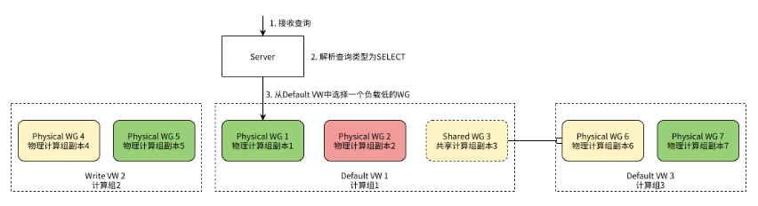
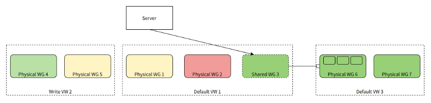

# resource manager

The Resource Manager (RM) component is used for unified management and scheduling of ByConity computing resources, and is the core component to achieve resource elasticity and improve resource utilization.

## Target

The core design goals of ByConity Explorer are as follows:

1. Able to manage and schedule computing resources to improve resource utilization.
2. It can collect the monitoring data of computing group VW, which is convenient for resource scheduling based on load.
3. It can provide scheduling functions for queries, INSERTs, and various background tasks.
4. Able to coordinate different VWs and dynamically allocate VW resources.
5. Realize resource pooling and elastic scaling functions.

## The hierarchy of computing resources

In order to achieve the above goals, we divide and manage computing resources hierarchically.

### Compute Node Worker

In [Main Principle Concepts](../introduction/main-principle-concepts), we know that the smallest computing unit in ByConity computing resources is a Worker node, which corresponds to a Kubenetes Pod.

After Worker starts, it will periodically report heartbeat information to RM, including:

- Identification information, such as WORKER_ID, WORKER_GROUP_ID, VIRTUAL_WAREHOUSE_ID, etc.
- Node physical load information, such as CPU usage, MEMORY usage, etc.
- Query load information, such as the number of running queries, the number of queued queries, etc.

RM maintains and updates the status of each Worker in time, and routes and schedules the query according to the identity and load information of the Worker when processing the query.

### Compute Group Replicas Worker Group

A Worker Group (WG for short) is a computing resource used to actually process a query request, and it corresponds to a Kubenetes StatefulSet.

A computing group replica consists of multiple workers, and the WORKER_GROUP_ID in each worker's identity indicates the worker group to which it belongs. At the same time, by summarizing the load information of all Workers in the Worker Group, we can obtain the aggregated load information of the Worker Group, such as average CPU usage, maximum CPU usage, average MEMORY usage, maximum MEMORY usage, etc.

There are two types of computing group replicas: Physical and Shared.

- The copy of the physical computing group (Physical Worker Group) is bound to a set of actual physical resources (Kubernetes StatefulSet).
- The shared computing group copy (Shared Worker Group) is not bound to physical resources, but points to another Physical Worker Group by reference. Shared Worker Group has independent identification information, namely WOKRER_GROUP_ID, and the load information is the load information of the corresponding Physical Worker Group.

When we need to manage (create, delete, etc.) a copy of a physical computing group, in addition to modifying the meta information inside ByConity, we also need to perform the corresponding K8s operations. To manage a shared computing group copy, you only need to modify the meta-information of the computing group copy, because the shared computing group copy does not own any physical resources.

### Virtual Warehouse

A computing group (Virtual Warehouse, referred to as VW) consists of multiple copies of computing groups with the same configuration. The VIRTUAL_WAREHOUSE_ID in the Worker ID identifies the VW to which it belongs.

VW is divided into two types: Default and Write.

- The Default VW is responsible for processing the user's normal SELECT query, and the Default VW is also called the Read VW.
- Write VW is responsible for processing users' INSERT queries, and running ByConity's background tasks such as Merge and Mutate (link background tasks).

The distinction between Default and Write VW enables ByConity to easily separate reads and writes to maximize query performance.

## Scheduling process

Each ByConity user table needs to specify its own default VW and write VW. After that, RM will undertake all the scheduling work of this table: SELECT query, INSERT query, background tasks, etc.

### SELECT Query scheduling process

When the server finds that the Query is a SELECT Query, it needs to select a WG from the Default VW of the table to process the query.

As shown in the figure, suppose there are 2 Physical WGs in the Default VW of the table, and 1 Shared WG (pointing to the Physical WG in another VW). Since it is a SELECT query, we need to select 1 WG to process the query. Physical WG 1 is currently the least loaded WG and is selected to handle the query.

### INSERT Query scheduling process

When the server finds that the Query is an INSERT Query, it needs to select a Worker from the table's Write VW to process the query.

As shown in the figure, suppose there are 2 Physical WGs in the Write VW of the table, and each WG contains 3 Workers. Because it is an INSERT query, we need to choose a Worker to process the query. Worker 3 currently has the lowest load and is selected to process the query.

### Scheduling process of background tasks

In addition to processing user queries, the server also needs to schedule background tasks for the table, such as continuously performing Merge on the table data in the background to improve query performance.

As shown in the figure, the Server generates a Merge task and needs to select a Worker from the Write VW to process it. Worker 3 currently has the lowest load and is selected to execute the Merge task.

## High Availability & Compatible Upgrade

1. Adopt a simple multi-copy master-slave configuration.
2. The worker's heartbeat is only sent to the master node, and the server's request is only processed by the master node.
3. When the primary node goes down, the standby node takes over the service and synchronizes the necessary metadata from the KV database.
4. Since the Server has a cache of VW, WG, and Worker information, even if the RM is unavailable for a short time, the service node can still use the cached data to continue working.

## Flexible sharing of computing resources

Scheduling queries and background tasks based on Worker load information makes the WG and Worker loads in a VW more balanced. In addition, we can achieve elastic sharing of resources between VWs by creating a suitable Shared WG (Shared Computing Group).

When the overall resource utilization of a Physical WG is low, a Shared WG can be created in other VWs that require more computing resources and point to the Physical WG. In this way, this Physical WG can be used by other VW's queries or tasks.

As shown in the figure, in Default VW 1, we created a shared computing group Shared WG 3, which does not own any actual physical computing resources, but points to another physical computing group Physical WG 6 in Default VW 3. Shared WG 3 has exactly the same load information as Physical WG 6. When Default VW 1 makes scheduling decisions, Shared WG 3 (or its Worker) can be selected to process SELECT queries (or INSERT queries, background tasks). Ultimately, queries or background tasks are actually routed to Physical WG 6 for processing.

## Reference Documentation

[Cloud Native Data Warehouse ByteHouse Technical White Paper V1.0 (Chinese)](./assets/resource-manager/云原生数据仓库ByteHouse技术白皮书V1.0.pdf)
