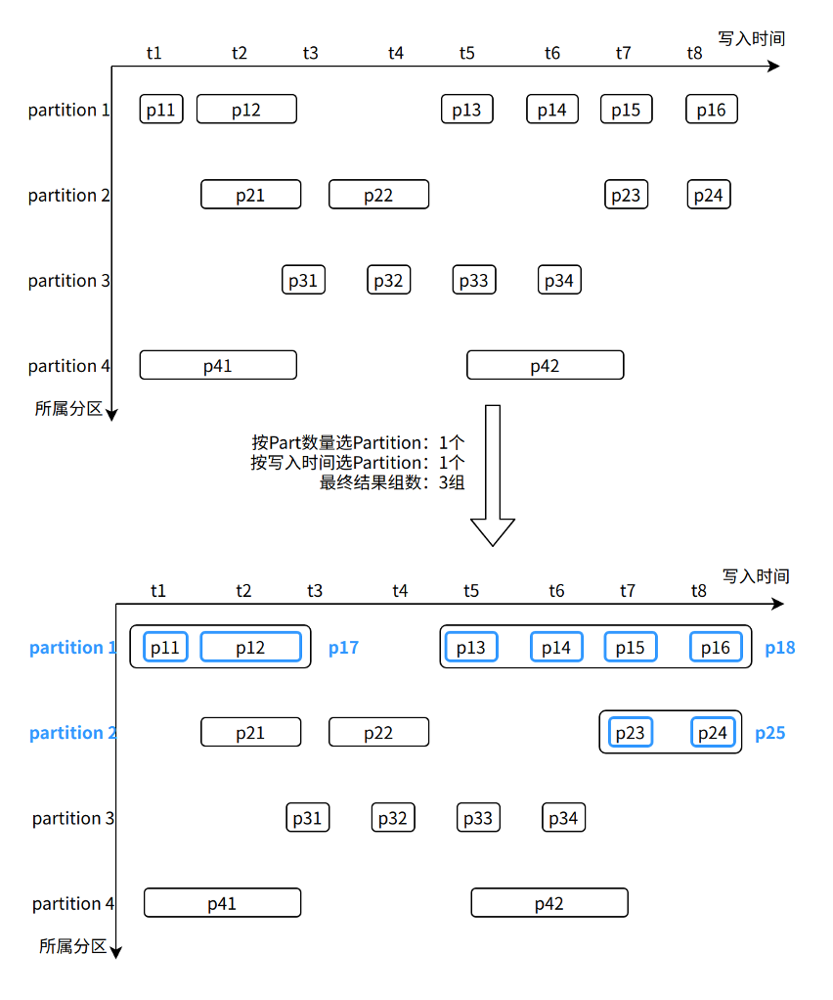
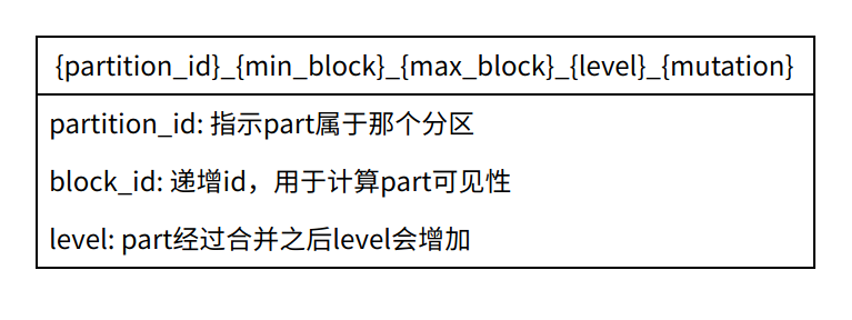
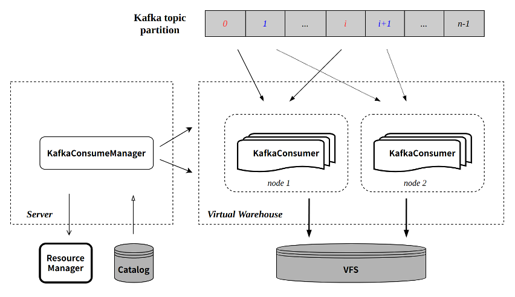

# Background Tasks Management

Document Type: Tutorial

Document structure: tutorial purpose, pre-preparation, step-by-step explanation of principles & examples, and related document recommendations;

Summary:

1. What are the common background tasks and their functions
2. How to manually start and terminate background tasks
3. How to deal with common errors

ByConity reuses the classic design of [Community ClickHouse MergeTree](https://clickhouse.com/docs/en/engines/table-engines/mergetree-family/mergetree/), which means that data is written at Part granularity Store and ensure the order of data inside each Part, and process multiple Parts in parallel when executing queries. The background Merge thread continuously merges multiple Parts into larger Parts, which not only reduces the number of Parts, but also achieves a wider range of data ordering, which is a key operation for continuously improving query performance.

## Common background tasks

**MergeMutate background task: **Because ByConity is a storage and computing separation architecture, Part no longer belongs to a fixed node, and each Part can be processed by any computing node, so each computing node does not run exclusively like the community ClickHouse Merge and Mutate threads. Instead, we create a Merge and Mutate background task for each table on the Server component, which manages and schedules all Merge and Mutate tasks for the corresponding table in a unified manner.

**GC\*\***Background task:\*\*Merge multiple Parts into a new Part, which means that the original Part will no longer be used, and deleting these eliminated Parts in time will help save storage. To this end, we run a dedicated GC (Garbage Collection) background task for each table, which is responsible for the discovery and deletion of expired parts of the table.

**CONSUMER background task: **Based on ByConity's new cloud-native architecture, a new design and implementation has been made on real-time import consumption (aka CnchKafka):

- Based on each Kafka consumption table, a CONSUMER background task (ConsumeManager) is resident in the server segment;
- The CONSUMER background task is responsible for reading Kafka meta information, assigning partitions to each consumer task, and then distributing task tasks to worker nodes for execution;
- At the same time, the CONSUMER task needs to maintain a heartbeat with the task to ensure that each consumer task is in a normal working state.

By design, Merge and GC are two separate processes. After a Merge task is completed, we will not delete the old part immediately, but correspondingly generate an elimination mark for each old part, waiting for subsequent GC tasks to be processed uniformly. Such a design can:

- Maintain the consistency of the Part life cycle, and there will be no inconsistent behavior of "using a deleted Part" during query execution.
- Avoid bulky metadata and storage access operations. Deleting the old part immediately when the merge is completed means a large number of fragmented IO operations, which makes the operation inefficient and easily affects the normal execution of other processes.
- Simpler implementation. There is no need to think too much about the consistency between the Merge task state and the Part state.


Figure X-1

## MergeMutate background task

MergeMutate background tasks are mainly responsible for: Select the appropriate Part to generate the corresponding **Merge Task (Merge Task)**, select the appropriate part to generate **Mutate Task (Mutate Task)**, and send the generated Task to Appropriate Worker execution and final submission and update of Part status.

Merge and Mutate are actually two different tasks.

The Merge task is to select some smaller parts to synthesize a larger part, so as to reduce the number of files accessed during query, thereby reducing the time required for query.

The Mutate task is to perform changes on some columns in the part (Modify column, Drop column, etc.). The Mutate task is generated by the Alter query. For an Alter query, we can split it into two parts, one is to modify the schema operation of the table, and the other is to generate a Mutate Task to be executed by the background task if the data needs to be changed. Data modification operations.

### Merge task Part selection

From the very beginning of design, ByConity requires that a system be able to handle different scenarios and businesses of different scales at the same time: the coexistence of real-time tables and offline tables, the coexistence of large-scale tables and small tables, the coexistence of wide tables and narrow tables, etc., complex fields and simple fields coexist. Such a complex application scenario means that the Parts of each table have no uniform rules to follow in terms of size, timeliness, and orderliness. To this end, we design and implement an adaptive Part selection strategy. The general process is as follows:

- Maintain the latest data write time, total number of Parts and total size for each partition (Partition).
- First select a batch of partitions from all partitions, and users can specify their preferred strategy for each table: sort by write time; sort by the number of parts or training in rotation.
- For each selected partition, scan all its Parts, calculate the benefits of merging each other according to the number of rows, size, and writing time of the Parts, and finally select multiple groups of Parts in the order of benefits.
- Finally, for each selected partition, if no high-yielding Merge task is finally selected from the partition, the partition will not be selected for a subsequent period of time to achieve adaptive adjustment.



Figure X-2

As shown in the figure, in the Partition selection stage, we selected Partition 1 (the largest number of Parts) and Partition 2 (the latest data writing). Then calculate the combined income between Parts from these two Partitions, and finally select three groups of Parts: p11~p12, p13~p16, and p23~p24.

### Task scheduling management

For each group of Parts selected above, we will estimate its task overhead, such as required disk size, occupied memory size, and other information. Then select the most suitable Worker for this task through <u>Resource Manager</u> (Note: link to RM), and send it out for execution.

When Worker executes a task, it obtains the required Part through the interface provided by the storage layer. The merging process of Part on Worker is similar to the principle of Community ClickHouse.

After the Merge task is executed, the Worker returns a successful execution flag to the Server. After that, the server can submit the newly generated Part and mark the merged source Part, waiting for subsequent GC background tasks to process.

### Heartbeat Mechanism

Since the execution time of the MergeMutate task may be relatively long, we need to use the heartbeat mechanism to detect whether the task on the Worker has failed or whether the Worker has been down, and remove the failed task on the Server in time. At the same time, the Worker side will also judge whether the Server is down by the time of the last synchronization heartbeat when executing the task, so as to end the task in advance to avoid wasting resources.

## GC background tasks

### Part visibility judgment

Different from the part visibility judgment in the community, ByConity has made some adjustments to the part visibility judgment in order to better implement the MVCC (Multi-Version Concurrency Control) feature.

First, briefly introduce the naming structure of writing part. Part naming is as follows:



1. Community version Part visibility judgment, taking the Merge task as an example


1. ByConityPart visibility judgment (TODO)

### GC Task

After understanding the role and process of <u>Merge</u> and Part visibility rules, you can better understand the working mechanism of GC.

As shown in Figure X-1, the GC background task of each table runs independently, and it is mainly responsible for discovering and deleting the eliminated parts generated by the Merge task.

When the server marks an obsolete part, it does not change any state of the part, but generates a new corresponding marked part, and the marked part does not occupy the actual storage space. Doing so can guarantee the absolute immutability of all Parts throughout the lifetime. \*\*

Based on Figure X-2, after the Merge is completed, it will become the state shown in Figure X-3 below:


When the GC background task is running, it is similar to the Merge background task,

- A batch of Partitions will be selected in order of the total number of Parts and total size.
- Then scan all Parts in the Partition, and delete the Part covered by the mark (that is, the blue part).
- Then scan all Parts in the Partition again, and delete the marked Part (that is, the red part).

## CONSUMER tasks

ByConity inherits the basic design of community Kafka consumption, and designs and implements a new consumption table engine CnchKafka based on the new cloud-native architecture. The basic consumption principle is consistent with the community, and the entire consumption link is realized through a <CnchKafka consumption table, Materialized View materialized view table, storage table> triplet, where:

- CnchKafka consumption table: responsible for subscribing to Kafka topics and consuming messages; parsing the obtained messages and writing them as Blocks;
- Materialized View materialized view table: build a data path from the consumption table to the storage table, write the block consumed by CnchKafka into the storage table, and provide a simple filtering function;
- Storage table: Support various MergeTree storage tables of Cnch.

The basic data path is as follow:



The components in the figure are ByConity components related to CnchKafka. For specific component descriptions, please refer to the architecture document.

### KafkaConsumeManager

Each CnchKafka consumption table will start a Manager (that is, CONSUMER type background task) at the server layer to be responsible for scheduling and managing all consumer tasks. The Manager itself is a resident thread on the server side, and its service is guaranteed to be stable through the high availability of the server and DaemonManager.

The main implementation and functions of KafkaConsumeManager include:

- Distribute the topic partition evenly to each consumer according to the configured number of consumers;
- Interact with the Catalog to obtain the offset consumed by the partition;
- Schedule the consumer to the configured Virtual Warehouse node for execution:
- Node selection supports multiple policy configurations to ensure load balancing;
- Regularly detect each consumer task to ensure the stability of task execution.

### KafkaConsumer

Each KafkaConsumer is implemented as a resident thread and executed on the Virtual Warehouse node. It is responsible for consuming data from the specified topic partition, converting it into parts and writing it to VFS, and submitting meta information back to the server side for writing to the Catalog. main feature:

- Inherit the batch writing mode of the community (each consumption cycle defaults to 8 seconds);
- Each consumption process guarantees atomicity through Transaction:
- Create transactions by interacting with Server RPC;
- The transaction commit will submit the written part meta-information and the latest consumed offset at the same time.

Refer to the figure below for the execution process of a single consumption:


### Exactly-Once

Compared with the community implementation, the CnchKafka implementation has enhanced consumption semantics, that is, from the community's At-Least-Once semantics to Exactly-Once semantics. This is mainly due to the guarantee of the new architecture Transaction.

Since each round of consumption will go through transaction management, and the corresponding offset will be submitted at the same time as the data metadata information is submitted each time. Since the transaction guarantees the atomicity of the commit, the data metadata and offset are either submitted successfully at the same time, or both fail to be submitted.

This ensures that the data and offset are always consistent, and each restart of consumption will continue to consume from the last submitted offset position, thus realizing Exactly-Once.

### Automatic fault tolerance implementation

CnchKafka's overall fault-tolerant strategy adopts **fast failure** approach, namely:

- KafkaConsumeManager regularly detects consumer tasks, if the detection fails, a new consumer is immediately pulled;
- In each execution of KafkaConsumer, the two interactions with Server RPC (creating transaction and submitting transaction) will verify the validity of itself to the Manager. If the verification fails (for example, the Manager has pulled a new consumer, etc.), it will Take the initiative to kill yourself.

### Modify consumption parameters

Supports quick modification of Setting parameters through the ALTER command, which is mainly used to adjust the number of consumers and improve consumption capabilities.

Command:

```
ALTER TABLE <cnch_kafka_name> MODIFY SETTING <name1> = <value1>, <name2> = <value2>

```

Execution of this command will automatically restart the consumption task.

### Manually start and stop consumption

In some scenarios, users may need to manually stop consumption, and then manually resume; we provide the corresponding SYSTEM command implementation:

```
SYSTEM START/STOP/RESTART CONSUME <cnch_kafka_name>

```

Note: The START/STOP command will persist the corresponding state to the Catalog, so after executing the STOP command, if you do not execute START, even if the service restarts, the consumption task will not resume.

## Control background tasks

The system command is provided to control the opening and closing of background tasks. Unlike the community, the control through the system command is a persistent operation, and background tasks that have been stopped will not be rescheduled after the server restarts.

Provide the system table system.bg_threads to view the status of background tasks, including thread status, scheduling times, scheduling exception information, etc.

```
SYSTEM STOP/START/RESTART CONSUME db.table;
SYSTEM STOP/START MERGES/GC db.table;
SELECT * FROM system.bg_threads WHERE database = 'db' AND table = 'table';
```

## common error

1. Connection Refused from DaemonManager

```
Code: 5038. DB::Exception: Received from 127.0.0.1:9000. DB::Exception: 112:[E111]Fail to connect Socket{id=1155 addr=127.0.0.1:10090} (0x0x7f2f9674f6c0): Connection refused [R1][E112]Not connected to 127.0.0.1:10090 yet, server_id=1155 [R2][E112]Not connected to 127.0.0.1:10090 yet, server_id=1155 [R3][E112]Not connected to 127.0.0.1:10090 yet, server_id=1155.

```

The specific error information is as above, where 10090 is the rpc port of DaemonManager, which means that the connection of DaemonManager component failed, and the status of DaemonManager needs to be checked.
