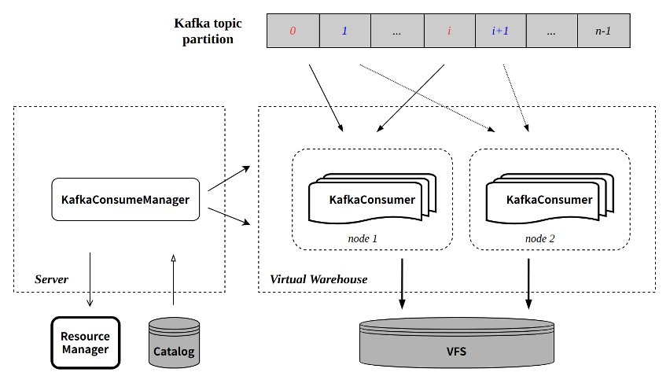

# Import Data

Document Type: Tutorial

Document structure: tutorial purpose, pre-preparation, step-by-step explanation of principles & examples, and related document recommendations;

Summary:

1. Which methods are supported to import data, and are there any suggestions on the import method (such as directly writing and merging part files after attaching)
2. How to connect to upstream supported data sources
3. How to check the data import status
4. What to do for common import errors

# Supported data sources

Various data import schemes are provided, and different data import methods can be selected for different data sources.

## Divide by scene

Data source

Import method

local files

Streaming import data (local files and memory data)

HDFS

Import from external strorage data

Kafka

Import data from Kafka

Import from spark

Import external data from Spark

Mysql、Hive

Access to external data sources via ByConity

## Supported data formats

Import method

Supported Data Formats

HDFS

Parquet，ORC，csv，gzip

Local files and memory data

snappy compression format

json, csv, TSKV，Parquet，ORC

Kafka

csv, gzip,json

# Import Method

## Streaming import data (local files and memory data)

### Method 1:

Method 1 uses the regular syntax of the VALUES format, which is suitable for temporarily inserting a small amount of data for testing:

```
INSERT INTO [db.]table [(c1, c2, c3...)] VALUES (v11, v12, v13), (v21, v22, v23), ...

```

Among them, c1, c2, c3 are column field declarations, which can be ignored. Immediately after VALUES is the written data composed of tuples, which corresponds to the column field declaration through subscript bits. The data supports batch statement writing, and multiple lines of data are separated by commas.

For example, consider this table:

```
CREATE TABLE test.insert_select_testtable
(
    `a` Int8,
    `b` String,
    `c` Int8,
    `date` Date
)
ENGINE = CnchMergeTree()
PARTITION by toYYYYMM(date)
ORDER BY tuple()

```

```
INSERT INTO insert_select_testtable VALUES (1, 'a', 1,'2022-11-10');

```

When writing data using the syntax of the VALUES format, expressions or functions are supported, for example:

```
INSERT INTO insert_select_testtable VALUES (1, 'a', 1, now());

```

### Method 2:

The second way is to use the syntax of the specified format:

```
INSERT INTO [db.]table [(c1, c2, c3...)] FORMAT format_name data_set

```

ByConity supports multiple data formats, taking the commonly used CSV format as an example:

```
INSERT INTO insert_select_testtable FORMAT CSV \
1, 'a', 1, '2022-11-10'\
2, 'b', 2, '2022-11-11'

```

At the same time, it also supports inserting data into tables from files. For example:

```
INSERT INTO [db.]table [(c1, c2, c3)] FORMAT format_name INFILE file_name

```

Use the above statement to read data from the client’s file and insert it into the table. file_name and type are both String types, and the format of the input file must be set in the FORMAT statement.

### Method 3:

The third way is to use the form of the SELECT clause, which is suitable for the situation where the results of a certain table need to be saved and used for subsequent queries:


```
INSERT INTO [db.]table [(c1, c2, c3...)] SELECT ...

```

```
The corresponding relationship with the SELECT column when writing is to use the position to correspond, although the names in the SELECT expression and INSERT are different. If necessary, the corresponding type conversion will be performed.
```

The query result can be written into the data table through the SELECT clause. Assuming that the data of insert_select_testtable_1 needs to be written into insert_select_testtable, the following statement can be used:

```
INSERT INTO insert_select_testtable SELECT * from insert_select_testtable_1

```

When writing data through the SELECT clause, it also supports adding expressions or functions, for example:

```
INSERT INTO insert_select_testtable SELECT 1, 'a', 1, now();

```

Although both the forms of VALUES and SELECT clauses support declaring expressions or functions, expressions and functions will bring additional performance overhead, resulting in degraded write performance. So if you pursue the ultimate write performance. So if you pursue the ultimate write performance, you should avoid using them.

## Import data from external storage

ByConity also supports importing data from local or HDFS, for example:

```
INSERT INTO [db.]table [(c1, c2, c3)] FORMAT format_name INFILE 'hdfs://ip:port/file_name'

```

## Import data using kakfa

### Function definition

CnchKafka is a table engine adapted to the cloud-native architecture implemented by ByConity based on the self-developed community ClickHouse Kafka table engine. It is used to efficiently and quickly import user data from Apache Kafka into ByConity in real time; At the same time, some functions have been enhanced based on the community implementation.

The main features of CnchKafka include:

- Provide automatic fault tolerance based on the advantages of cloud-native architecture to reduce operation and maintenance costs;
- Scalable consumption capability: support to adjust the number of consumers through the SYSTEM command, and the maximum number of partitions corresponding to the topic can be adapted;
- Enhanced consumption semantics: Rely on Transaction guarantee, implement Exactly-Once consumption semantics through engine management offset;
- Consumption performance: largely depends on the schema complexity of the user table, usually the experience value is 2k-2M entries/second, and the throughput is about 15MiB/s;
- Support multiple data types, including but not limited to Json, ProtoBuf, CSV, etc.;
- Supports recording consumption logs, which not only facilitates troubleshooting, but also provides the ability to audit data.

### Implementation principle

#### Overview

CnchKafka inherits the basic design of the community, that is, realizes the entire consumption link through a <CnchKafka consumption table, Materialized View materialized view table, storage table> triplet, in which:

- CnchKafka consumption table: responsible for subscribing to Kafka topics and consuming messages; parsing the obtained messages and writing them as Blocks;
- Materialized View materialized view table: build a data path from the consumption table to the storage table, write the block consumed by CnchKafka into the storage table, and provide a simple filtering function;
- Storage table: Support various MergeTree storage tables of Cnch.

The basic data path is as follows:



The components in the figure are the components of the ByConity cloud-native architecture that involve CnchKafka. In order to avoid readers' ignorance, here is a brief description of each component; but due to space limitations and key points, please refer to the architecture document for more detailed architecture design details.

- **Server**
- Application access layer, the entrance of all query and import tasks;
- Lightweight design, no specific query and import itself, mainly responsible for task scheduling forwarding and metadata access, including:
- Preprocess the query request, read the metadata from the Catalog, send the original data and query sql to the query node, and return the query result to the upper layer (call interface or user, etc.);
- Manage import tasks: select the import node to execute the import task;
- Interact with Catalog to query or update metadata;
- Interact with Resource Manager to select task execution nodes to ensure load balancing;
- **Virtual Ware House**
- Computing layer, the execution node of all query and import tasks, stateless service;
- Support exclusive use by tenants to achieve resource and data isolation;
- Support read-write separation, query and import can create and specify different Virtual WareHouse;
- **Catalog**
- KV database, used for metadata management, including database table meta information, part meta information, etc.;
- CnchKafka consumption offset is also stored in the catalog;
- **VFS**
- Underlying storage, supporting multiple storage systems, including HDFS, S3, etc.

#### KafkaConsumeManager

Each CnchKafka consumption table will start a Manager at the server layer to be responsible for scheduling and managing all consumer tasks. The Manager itself is a resident thread on the server side, and its service is guaranteed to be stable through the high availability of the server and DaemonManager.

The main implementation and functions of KafkaConsumeManager include:

- Distribute the topic partition evenly to each consumer according to the configured number of consumers;
- Interact with the Catalog to obtain the offset consumed by the partition;
- Schedule the consumer to the configured Virtual Warehouse node for execution:
- Node selection supports multiple policy configurations to ensure load balancing;
- Regularly detect each consumer task to ensure the stability of task execution.

#### KafkaConsumer

Each KafkaConsumer is implemented as a resident thread and executed on the Virtual Warehouse node. It is responsible for consuming data from the specified topic partition, converting it into parts and writing it to VFS, and submitting meta information back to the server side for writing to the Catalog. main feature:

- Inherit the batch writing mode of the community (each consumption cycle defaults to 8 seconds);
- Each consumption process guarantees atomicity through Transaction:
- Create transactions by interacting with Server RPC;
- The transaction commit will submit the written part meta-information and the latest consumed offset at the same time.

Refer to the figure below for the execution process of a single consumption:


#### Exactly-Once

Compared with the community implementation, the CnchKafka implementation has enhanced consumption semantics, that is, from the community's At-Least-Once semantics to Exactly-Once semantics. This is mainly due to the guarantee of the new architecture Transaction.

Since each round of consumption will go through transaction management, and the corresponding offset will be submitted at the same time as the data metadata information is submitted each time. Since the transaction guarantees the atomicity of the commit, the data metadata and offset are either submitted successfully at the same time, or both fail to be submitted.

This ensures that the data and offset are always consistent, and each restart of consumption will continue to consume from the last submitted offset position, thus realizing Exactly-Once.

#### Automatic fault tolerance implementation

CnchKafka's overall fault-tolerant strategy adopts **fast failure** approach, namely:

- KafkaConsumeManager regularly detects consumer tasks, if the detection fails, a new consumer is immediately pulled;
- In each execution of KafkaConsumer, the two interactions with Server RPC (creating transaction and submitting transaction) will verify the validity of itself to the Manager. If the verification fails (for example, the Manager has pulled a new consumer, etc.), it will Take the initiative to kill yourself.

### user's guidance

#### Create table

Creating a CnchKafka consumption table is similar to creating a Kafka table natively in the community. You need to configure the Kafka data source and consumption parameters through the Setting parameter. Examples are as follows:

```
CREATE TABLE kafka_test.cnch_kafka_consume
(
    `i` Int64,
    `ts` DateTime
)
ENGINE = CnchKafka()
SETTINGS
kafka_broker_list = '10.10.10.10:9092',  -- replace with your own broker list
kafka_topic_list = 'my_kafka_test_topic', -- topic name to subcribe
kafka_group_name = 'hansome_boy_consume_group', -- your consumer-group name
kafka_format = 'JSONEachRow', -- always be json
kafka_row_delimiter = '\n', -- always be \n
kafka_num_consumers = 1

```

(For setting parameter description and other more parameter support, please refer to the description below)

Since the Kafka consumption design requires three tables, two other tables need to be created synchronously.

First create a storage table (take CnchMergeTree as an example):

```
CREATE TABLE kafka_test.cnch_store_kafka
(
    `i` Int64,
    `ts` DateTime
)
ENGINE = CnchMergeTree
PARTITION BY toDate(ts)
ORDER BY ts

```

Finally, create the materialized view table (it must be created after the Kafka table and storage table are successfully created):

```
CREATE MATERIALIZED VIEW kafka_test.cnch_kafka_view
TO kafka_test.cnch_store_kafka
(
    `i` Int64,
    `ts` DateTime
)
AS
SELECT * -- you can add virtual columns here if you need
FROM kafka_test.cnch_kafka_consume

```

If you have the consumption permission corresponding to the topic, after the three tables are created, the consumption will start automatically.

#### Virtual column support

Sometimes the business needs to obtain the metadata of Kafka messages (e.g. message partition, offset, etc.). At this time, you can use the virtual columns function to meet this requirement. Virtual columns do not need to be specified when creating a table, they are attributes of the table engine itself. It can be placed in the SELECT statement of the VIEW table and stored in the bottom table (when the corresponding column is added to the bottom table):

```
SELECT
    _topic,    -- String
    _partition,    -- UInt64
    _key,    -- String
    _offset,    -- UInt64
    _content,  -- String: complete message content
    *    -- Normal columns can be expanded by *, virtual columns cannot
FROM kafka_test.cnch_kafka_consume

```

#### Setting Parameter Description

**Parameter Name**

**type**

**required/default**

**Description**

kafka_cluster / kafka_broker_list

String

required

Kafka cluster within the company

Community version Kafka please use `kafka_broker_list` parameter

kafka_topic_list

String

required

Can be multiple, separated by commas

kafka_group_name

String

required

consumer group name, consumer group

kafka_format

String

required

Message format; currently most commonly used JSONEachRow

kafka_row_delimiter

String

'\0'

common use '\n'

kafka_num_consumers

UInt64

1

The number of consumers, it is recommended not to exceed the maximum number of partitions in the topic

kafka_max_block_size

UInt64

65536

write block_size，the upper limit is 1M

kafka_max_poll_interval_ms

Milliseconds

7500

the max time to poll from broker each iteration

kafka_schema

String

""

Schema file setting parameters, set in the format of file name + colon + message name

Such as: `schema.proto:MyMessage`

kafka_format_schema_path

String

""

Remote schema file path (without file name) setting parameter, currently only supports hdfs.

(If this parameter is not set, it will be read from the default path set in the configuration file)

kafka_protobuf_enable_multiple_message

bool

true

If set to true, it means that multiple protobuf messages can be read from one kafka message, separated by their respective lengths

kafka_protobuf_default_length_parser

bool

false

It only takes effect when `kafka_protobuf_enable_multiple_message` is true: true means that the message header has a variable record length; false means use a fixed 8 bytes as the header record length.

kafka_extra_librdkafka_config

Json format string

""

(More params refer to [here](https://github.com/edenhill/librdkafka/blob/master/CONFIGURATION.md#:~:text=see%20dedicated%20API-,ssl.ca.location,-*))

Other parameters supported by rdkafka, usually used for authentication

- **SCRAM**: "{"sasl.mechanisms":"SCRAM-SHA-512","sasl.password":"**\*","sasl.username":"bytehouse-dev","security.protocol":"sasl_ssl","ssl.ca.location":"**"}"
- **PLAIN**: "{"sasl.mechanisms":"PLAIN","sasl.password":"admin","sasl.username":"admin","security.protocol":"sasl_plaintext"}"

cnch_vw_write

String

"vw_write"

Configure consumption to use Virtual Warehouse, and the consumer task will be scheduled to the configured Virtual Warehouse node for execution

kafka_cnch_schedule_mode

String

"random"

The scheduling strategy used by ConsumeManager when scheduling consumer tasks currently supports: random, hash, and **least_consumers; **If it is an independent vw or the number of consumers is greater than 10, it is recommended to use **least_consumers**

#### Modify consumption parameters

Supports quick modification of Setting parameters through the ALTER command, which is mainly used to adjust the number of consumers and improve consumption capabilities.

command:

```
ALTER TABLE <cnch_kafka_name> MODIFY SETTING <name1> = <value1>, <name2> = <value2>

```

Execution of this command will automatically restart the consumption task.

#### Manually start and stop consumption

In some scenarios, users may need to manually stop consumption, and then manually resume; we provide the corresponding SYSTEM command implementation:

```
SYSTEM START/STOP/RESTART CONSUME <cnch_kafka_name>

```

Note: The START/STOP command will persist the corresponding state to the Catalog, so after executing the STOP command, if you do not execute START, even if the service restarts, the consumption task will not resume.

#### reset offset

Since CnchKafka's offset is managed and saved by the engine itself, when the user needs to restart the offset, we also implement the SYSTEM command operation. Specifically, the following three methods are supported:

##### A is reset to a special position: latest position/start position

command:

```
SYSTEM RESET CONSUME OFFSET '{"database_name":"XXX", "table_name": "XXX", "offset_value":-1}'

```

Possible position-specific value values:

```
    enum Offset {
        OFFSET_BEGINNING = -2,
        OFFSET_END = -1,
        OFFSET_STORED = -1000,
        OFFSET_INVALID = -1001
    };

```

##### B reset by timestamp

Version requirements >= cnch-1.4) command:

```
SYSTEM RESET CONSUME OFFSET '{"database_name":"XXX", "table_name": "XXX", "timestamp":1646125258000}'

```

The value of timestamp should be the timestamp of a certain time within the validity period of the data on the Kafka side, and it is in milliseconds.

##### C specifies the offset specific value

```
system reset consume offset '{"database_name":"XXX", "table_name": "XXX", "topic_name": "XXX", "offset_values":[{"partition":0, "offset":100}, {"partition":10, "offset":101}]}'

```

It is relatively rare to assign a specific topic partition to a specific offset value.

### Operation Manual

#### Common consumer performance tuning

When consumption continues to lag, it is usually insufficient consumption capacity. CnchKafka creates a table with one consumer by default, and the maximum block size for a single consumption write is 65536. When the consumption capacity is insufficient, the consumer and block-size parameters should be adjusted first. For the adjustment method, refer to the above **Modify Consumption Parameters**

##### Adjust max-block-size

- This parameter directly affects the consumption memory usage, the larger the value is, the more memory is required. For some consumption tables with large single data, carefully adjust this parameter to avoid memory explosion. (up to 1M)
- When the user does not have high requirements for data delay and the amount of data is large and the memory is sufficient, this parameter and the "kafka_max_poll_interval_ms" parameter can be adjusted synchronously to increase the consumption time of each round, increase the part written each time, and reduce the pressure of MERGE , to improve query performance.

##### Adjust num_consumers

- The upper limit of this parameter is the number of partitions corresponding to the consumption topic.
- In the case of no lag in consumption, reduce this parameter as much as possible (that is, avoid meaninglessly increasing this parameter), reduce resource usage, and avoid excessive consumption of fragmented parts, which increases MERGE pressure and is not conducive to queries.

#### System table for auxiliary troubleshooting

##### Consumption event: cnch_system.cnch_kafka_log

The kakfa_log table records some basic consumption events. To enable it, you need to configure the kafka_log item in config.xml (both server and worker need to be configured), and it will take effect after restarting.

The kafka_log is written by the consumer task in the Virtual Warehouse, and is aggregated into the global cnch_system.cnch_kafka_log table in real time, so that the consumption records of all consumption tables can be viewed from the server segment.

**Field Description**

**column name**

**type**

**illustrate**

event_type

Enum8

see table below

event_date

date

Date of occurrence of time. Partition field, it is recommended to bring it in every query.

event_time

DateTime

The time of occurrence of the time, in seconds

duration_ms

UInt64

Event duration, in seconds

cnch_database

String

CnchKafka library name

cnch_table

String

CnchKafka table name

database

String

consumer task library name (currently the same as cnch_database)

table

String

consumer task table name (usually cnch_table plus timestamp and consumer number suffix)

consumer

String

consumer number

metric

UInt64

consumption line

has_error

UInt8

1 means abnormal; 0 means no abnormal.

exception

String

exception description,

**Event Description**

**UInt8 value**

**String value**

**illustrate**

1

POLL

Metric indicates how many pieces of data are consumed, and duration_ms covers a complete consumption process, including the time of WRITE.

2

PARSE_ERROR

The metric indicates the number of consumption items with parsing errors. If there are multiple parsing errors, only one will be selected and printed out.

3

WRITE

Metric indicates the number of rows written to the data, and duration_ms is basically equivalent to the data persistence time

4

EXCEPTION

Abnormal consumption process. The common ones are: authentication exception, data persistence failure, and VIEW SELECT execution failure.

5

EMPTY_MESSAGE

The number of empty messages.

6

FILTER

The data to be filtered during the write phase.

7

COMMIT

The last transaction submission record, only this record indicates that the data was written successfully, which can be used as a data audit standard

##### Consumption status: system.cnch_kafka_tables

kafka_tables records the real-time status of the CnchKafka table, which starts by default and is a memory table;

**Field Description**

**field name**

**type of data**

**illustrate**

database

String

Database name

name

String

Kafka table name

uuid

String

Kafka table unique identifier UUID

kafka_cluster

String

kafka cluster

topics

Array(String)

Consume topic list

consumer_group

String

Belonging to the consumer group

num_consumers

UInt32

The number of consumers currently actually executing

consumer_tables

Array(String)

The data table name corresponding to each consumer

consumer_hosts

Array(String)

Execution nodes to which each consumer is distributed

consumemr_partitions

Array(String)

The partitions that each consumer is assigned to consume

#### Common troubleshooting consumption exception records

##### View the real-time status of CnchKafka consumption table

```
SELECT * FROM system.cnch_kafka_tables
WHERE database = <database_name> AND name = <cnch_kafka_table>

```

##### View recent consumption records

```
SELECT * FROM cnch_system.cnch_kafka_log
WHERE event_date = today()
 AND cnch_database = <database_name>
 AND cnch_table = <cnch_kafka_table>
 AND event_time > now() - 600 -- 最近十分钟
ORDER BY event_time

```

##### Statistics of consumption records of the day by hour

```
SELECT
 toHour(event_time) as hour,
 sumIf(metric, event_type = 'POLL') as poll_rows,
 sumIf(metric, event_type = 'PARSE_ERROR') as error_rows,
 sumIf(metric, event_type = 'COMMIT') as commit_rows
FROM cnch_system.cnch_kafka_log
WHERE event_date = today()
 AND cnch_database = <database_name>
 AND cnch_table = <cnch_kafka_table>
GROUP BY hour
ORDER BY hour

```

## Import external data through Spark

```
   Use the part writer tool to import ByConity, and the part writer tool can directly convert data files into part files without going through the ByConity engine. Using the part writer can realize the separation of ByConity query and construction, alleviate the resource competition of data import and query to a certain extent, and improve query performance. At present, the development of the part writer and ByConity's corresponding function of loading part files is basically completed. The following describes how to use the part writer to import data into ByConity.

    (1) Use part writer to generate part file
```

The part writer receives a sql statement as a parameter, and the user specifies the source data file, data file format, data schema, part file storage path and other detailed information through the sql statement. The usage is as follows:

```
./part_writer "load CSV file '/path/to/data/test.csv' as table db.tablename(col1 UInt64, col2 String, col3 Nullable(String)) partition by col1 order by (col2, col3) location '/ path/to/dest/'"

```

In the example SQL,

1. 'CSV' specifies the source data file format; in addition, the part writer can also use CSVWithNames, JSONEachRow and other data file formats natively supported by clickhouse.
2. '/path/to/data/test.csv' specifies the source data file; it supports reading source data from local and hdfs. If using hdfs data files, specify the path as: 'hdfs://host:port/path/to/data/file';
3. '/path/to/dest/' specifies the destination folder where part files are written; it supports writing part files directly to hdfs, and ByConity can pull and load part files from hdfs.
4. as table specifies the schema information of the inserted data
5. partition by and order by specify the partition key and sort key of the data table respectively. Multiple keys are separated by commas and need to be wrapped in parentheses, such as: partition by (name, id).
6. The ByConity special option, settings cnch=1, is used to directly dump the generated part into the ByConity part format and write it into the hdfs path specified by the location option.

(2) Import part files into ByConity

The generated part file can be directly copied to the data file path corresponding to the ByConity table, and then loaded by restarting the ByConity server;

You can also copy the part file directory to the detached directory of the table, and load the part file through the attach command, such as

```
alter table test attach part 'partfile'

```

If you specify to upload directly to hdfs when using part writer to generate part files, you can execute the following command:

```
system fetch parts into db.table 'hdfs://host:port/path/to/part/'

```

ByConity will automatically pull the part file from the hdfs path and load it.

ByConity attach syntax:

Used to import the parts dumped to hdfs into the target table:

```
alter table test attach parts from '/hdfs/path/to/dumped/dir'

```

At the same time, the fourth form also supports spark import:

In the actual application scenario, it is necessary to import a large amount of data into the ByConity cluster, you can consider using spark. First read the data into the spark dataset from the outside; then repartition the dataset according to the sharding key to ensure that the data to be sent to different ByConity nodes falls on different partitions (it may be necessary to adjust the parameters of spark.sql.shuffle.partitions according to the actual situation Make the partition not less than the number of ByConity master nodes); for each partition, first generate a part file by calling the part writer, and specify the part file to upload to hdfs, and then notify ByConity to load the part file by sending an http request to the corresponding ByConity node. The data flow diagram is as follows:


## Access external data sources through ByConity

###MySQL

The `MySQL` engine allows users to access MySQL tables through ByConity, and can make SELECT and INSERT queries.

#### Create Tables in MySQL

- create database

```
CREATE DATABASE db1;

```

- Create tables in mysql

```
CREATE TABLE db1.table1(
    id Int,
    column1 VARCHAR(255)
);

```

- insert some date

```
INSERT INTO db1.table1
    (id, column1)
values
    (1, 'mysql-ab'),
    (2, 'mysql-cd');

```

- Create a user in mysql to connect to mysql in ByConity

```
CREATE USER 'mysql_byconity'@'%' IDENTIFIED BY 'Password123!';

```

- Granted permission. (Here, for demonstration purposes, the `mysql_byconity` user has been granted admin privileges)

```
GRANT ALL PRIVILEGES ON *.* TO 'mysql_byconity'@'%';

```

#### Create MySQL table in ByConity

Now let's create a ByConity table that uses the **MySQL** table engine:

```
CREATE TABLE mysql_table1 (
   idUInt64,
   column1 String
)
ENGINE = MySQL('mysql-host.domain.com','db1','table1','mysql_byconity','Password123!');

```

The parameters of the `MySQL` engine are as follows:

parameter

describe

example

host

Domain name or IP:Port

mysql-host.domain.com

database

mysql database name

db1

tabele

mysql table name

table1

user

user to connect to mysql

mysql_byconity

password

Password to connect to mysql

Password123!

#### Test connection mysql table in ByConity

- Test SELECT query

```
select * from mysql_table1;

```


- Test INSERT query

```
INSERT INTO mysql_table1
    (id, column1)
VALUES
    (3, 'byconity-test');

```

- Validate data inserted from ByConity in MySQL

```
mysql> select id, column1 from db1.table1;

```


### Hive

```
CnchHive is a table engine provided by ByConity, which supports federated query in the form of external tables, and users can directly accelerate data query without importing data.
```

### use:

#### Example 1: Build a complete set of hive tables

```
--Create hive table
CREATE TABLE t
(
   client_ip String,
   request String,
   status_code INT,
   object_size INT,
   date String
)
ENGINE = CnchHive('psm', 'hive_database_name', 'hive_table_name')
PARTITION BY date;

--Parameter Description:
--psm:hivemetastore-psm
--hive_database_name: hive database name
--hive_table_name: hive table name

--Query hive external table
select * from  t where xxx;

```

#### Example 2: Building a subset of hive tables

```
CREATE TABLE t
(
  client_ip   String,
  request     String,
  date String
)
ENGINE = CnchHive('psm', 'hive_database_name', 'hive_table_name')
PARTITION BY date

--Parameter Description:
--psm：hivemetastore psm
--hive_database_name：hive database name
--hive_table_name：hive table name

--Query hive external table
select * from  t where xxx;

```

#### Example 3: hive bucket table construction

```
CREATE TABLE t
(
  client_ip   String,
  request     String,
  device_id   String,
  server_time String,
  date String
)
ENGINE = CnchHive('psm', 'hive_database_name', 'hive_table_name')
PARTITION BY date
CLUSTER BY device_id INTO 65536 BUCKETS
ORDER BY server_time
SETTINGS cnch_vw_default ='vw_default'

--Parameter Description：
--psm：hivemetastore psm
--hive_database_name：hive database name
--hive_table_name：hive table name

--Query hive external table
select * from  t where xxx;

```

illustrate:

- External column
- The column names need to correspond one-to-one with the hive table
- The order of the columns does not need to correspond one-to-one with hive
- You can select only some of the columns in the hive table, but the partition columns must include all of them.
- The partition of the external column needs to be specified through the partition by statement, and it needs to be defined in the description list like ordinary columns.
- When the Hive table is a bucket table, you need to specify the bucket column and the number of buckets when building the CnchHive engine. (CLUSTER BY xxx INTO xxx BUCKETS )
- When there is an ORDER BY field in the Hive table, the ORDER BY field needs to be specified when building the CnchHive engine.
- ENGINE specified as CnchHive
- engine parameters
- psm:hivemetastore-psm
- hive_database_name: specifies the database in hive
- hive_table_name: specifies the table in hive, does not support view.
- The supported column types correspond to the following table:

hive column type

CnchHive column type

describe

INT/INTERGER

INT/INTERGER

BIGINT

BIGINT

TIMESTAMP

DateTime

STRING

String

VARCHAR

FixedString

内部转换为 FixedString

CHAR

FixedString

Internally converted to FixedString

DOUBLE

DOUBLE

FLOAT

FLOAT

DECIMAL

DECIMAL

MAP

Map

ARRAY

Array

Description:

- The hive table schema change will not be automatically synchronized, and the hive table needs to be rebuilt in Clickhouse
- The current hive storage format only supports Parquet
- Currently CnchHive does not support insert and alter operations

#### SETTINGS

cnch_vw_default：to specify vw

max_read_row_group_threads: Used to specify the number of concurrent reads of Parquet row groups.

#### Operation Manual

keywords

Solution

DB::Exception: Can not insert NULL data into non-nullable column "name"

Add Nullable attribute to column field.

DB::Exception: The hive type is not match in cnch.

CnchHive schema type does not match Hive schema.

DB::Exception: column name xxx doesn't match.

CnchHive schema name does not match Hive schema.

DB::Exception: CnchHive only support parquet format. Current format is org.apache.hadoop.hive.ql.io.HiveIgnoreKeyTextOutputFormat.

CnchHive currently only supports Parquet as the storage format.

DB::Exception: No available nnproxy xxx.

There is a problem with the psm of HiveMetastore, you need to check whether the psm of HiveMetastore is accessible.

# Common errors and handling

keywords

reason

Solution

Too many map keys in table

(more than 10000)

The number of key types in the Map column exceeds 10,000

If it exceeds 10000, it cannot be imported, please import data to reduce the number of map keys

Memory limit (total)

Memory limit exceeded during import

Cannot parse JSON

The data type in json does not match that of clickhouse

Ask the user to check whether the upstream generated data type matches;

Duplicate field found while parsing JSONEachRow format: hour

The json data has repeated fields, and the repeated field here is hour, that is, the repeated field after "format:"

Check whether the upstream data is correct and the configuration is correct

HDFS json size xxx > 1099511627776

Import data is too large (1T), import is prohibited

Reduce the amount of imported data

Unable to parse hdfs json file

Data format error in hdfs

Ask the user to check whether the file in hdfs is legal json

DB::Exception: Error while reading parquet data: IOError: definition level exceeds maximum. Stack trace

hdsf file error reading error, most of which are caused by missing blocks.

HDFS files need to be regenerated

DB::Exception: Cannot parse string 'time="2021-11-12' as Date: syntax error at position 10 (parsed just 'time="2021'). Note: there are toDateOrZero and toDateOrNull functions, which returns zero/ NULL instead of throwing exception.: while pushing to view

In this case, there is dirty data in the user topic; when the Kafka table is consumed, it is parsed normally according to the string; but the writing to the bottom table is found to be illegal through the conversion of functions such as toDate, resulting in writing failure and blocking consumption

1. Temporarily modify the VIEW table to filter dirty data;

2. User upstream to add data cleaning and protection mechanism

3. The Kafka table analysis is consistent with the bottom table. It is not recommended to convert it during the writing phase. If Kafka analysis fails, dirty data can be discarded without blocking the entire consumption

Code: 1001, type: cppkafka::Exception, e.what() = Failed to create consumer handle: consumer regist error, please check output!

Open the trace log to view the specific error information on the Kafka side

Handle according to the error message

Code: 49, e.displayText() = DB::Exception: Check dependencies failed for

VIEW table not found

Rebuild the VIEW table

Code: 6001. DB::Exception: DB::Exception: Cannot get metadata of table XXX by UUID : XXX.

An error is reported when executing the ALTER TABLE command. The cnch table is bound to the server. This is because the table is not executed on the corresponding server.

First query system.cnch_table_host to obtain the server corresponding to the table, and then execute on the corresponding server

No space left on device: while pushing to view

disk full

clean disk

# Import parameter tuning

## Direct write mode tuning

When using INSERT VALUES, INSERT INFILE or PartWriter tools to write, the number of Parts generated at the end will affect the number of times written to HDFS and affect the overall writing time, so the number of Parts should be reduced as much as possible. The direct writing process is as follows:

- read part of file data
- Split this part of data according to PartitionBy
- Split this part of data according to ClusterBy
- Write the split data into a new Part and write it to HDFS

Tuning means:

1. In order to reduce the number of Parts, we can arrange the data with the same partition and Bucket in the file together, so that after reading some new data each time, the number of Parts generated will be as small as possible. The data can be sorted according to the requirement that the partitions are the same and the buckets in the partitions are the same. The calculation rules of the buckets are:

- If SPLIT_NUMBER is not specified, SipHash will be calculated for the column used by ClusterByKey and then the BucketNumber will be moduloed to get BucketNumber
- if SPLIT_NUMBER is specified
- Calculate SplitValue
- If a column is ClusterBy, use the dtspartition function to calculate the corresponding SplitValue
- If ClusterBy has multiple columns, use SipHash to calculate the corresponding SplitValue of these columns
- Calculate BucketNumber
- If it is WithRange, use SplitValue \* BucketCount / SplitNumber to calculate the corresponding BucketNumber
- If not WithRange, use SplitValue % BucketCount to calculate the corresponding BucketNumber

1. When reading a file
2. If the data size of each row is not large, you can read a larger block at a time by increasing max_insert_block_size, thereby generating a larger Part
3. If the file to be read is not HDFS/CFS and multiple files are matched using wildcards, you can also increase min_insert_block_size_rows and min_insert_block_size_bytes at the same time
