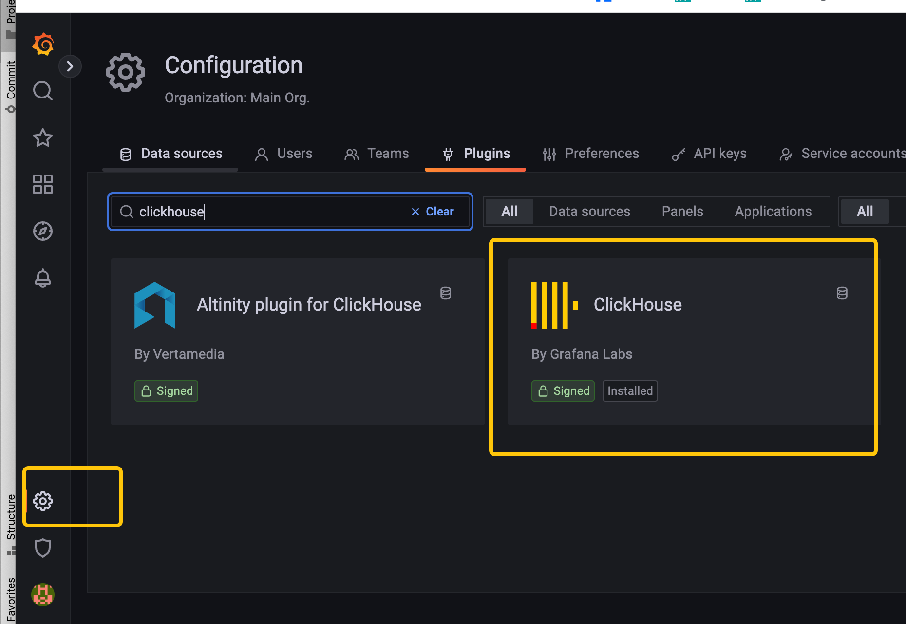
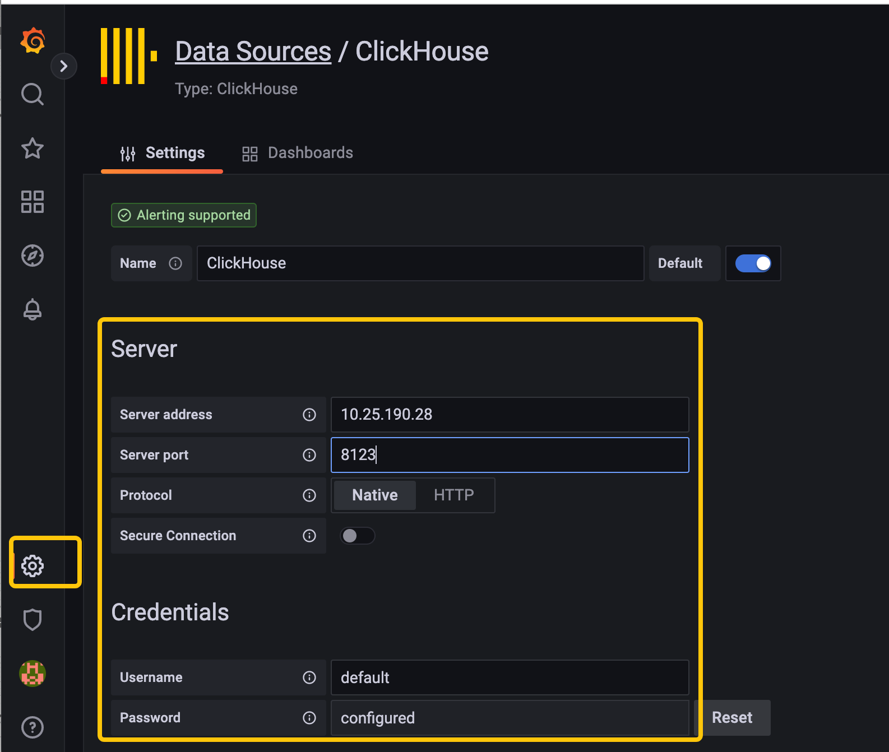
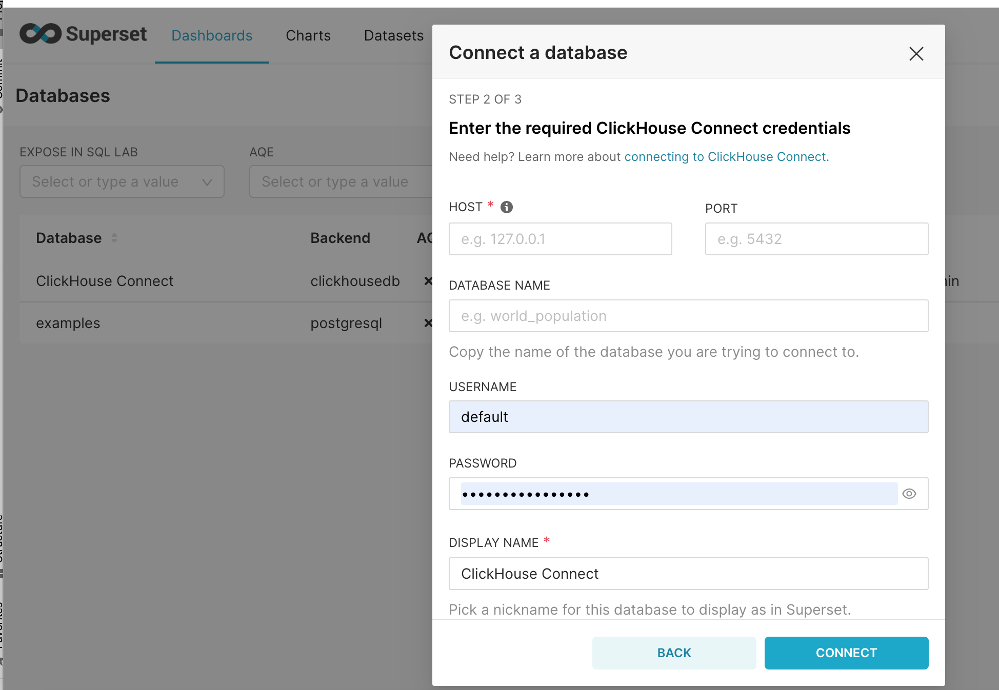
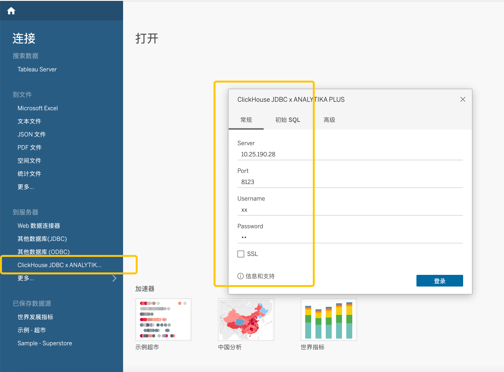

# Data Visualisation

## Tutorial goals:

This document is used to guide users to connect and use ByConity through common open source and commercial data visualization tools.

## Pre-preparation:

Users need to get the `HOST` and `PORT(TCP/HTTP)` of ByConity service

## Currently supported tools

Currently supported visualisation tools include:

- [Grafana](./data-visualisation#grafana)
- [Metabase](./data-visualisation#metabase)
- [SuperSet](./data-visualisation#superset)
- [Tableau](./data-visualisation#tableau)
- [Other](./data-visualisation#other)

## connection method:

### Grafana

It is consistent with the method of connecting open source clickhouse, refer to::

Connection method: [https://clickhouse.com/docs/en/connect-a-ui/grafana-and-clickhouse](https://clickhouse.com/docs/en/connect-a-ui/grafana-and-clickhouse)

Grafana installation method: [https://grafana.com/docs/grafana/v9.0/setup-grafana/installation/](https://grafana.com/docs/grafana/v9.0/setup-grafana/installation/)

### Metabase

It is consistent with the method of connecting open source clickhouse, refer to:

[https://clickhouse.com/docs/en/connect-a-ui/metabase-and-clickhouse](https://clickhouse.com/docs/en/connect-a-ui/metabase-and-clickhouse)

### SuperSet:

It is consistent with the method of connecting open source clickhouse, refer to:

Connection method: [https://clickhouse.com/docs/en/connect-a-ui/superset-and-clickhouse](https://clickhouse.com/docs/en/connect-a-ui/superset-and-clickhouse)

SuperSet installation method: [https://superset.apache.org/docs/installation/installing-superset-using-docker-compose](https://superset.apache.org/docs/installation/installing-superset-using-docker-compose)

### Tableau

It is consistent with the method of connecting open source clickhouse, refer to

Connection method: [https://clickhouse.com/docs/en/connect-a-ui/tableau-and-clickhouse/](https://clickhouse.com/docs/en/connect-a-ui/tableau-and-clickhouse/)

Tableau installation method: [https://www.tableau.com/products/desktop/download](https://www.tableau.com/products/desktop/download)

### Other

Since ByConity is fully compatible with the open source clickhouse driver (go/java/python), when using other open source visualization tools to connect to ByConity, you can refer to its method of connecting to clickhouse.
