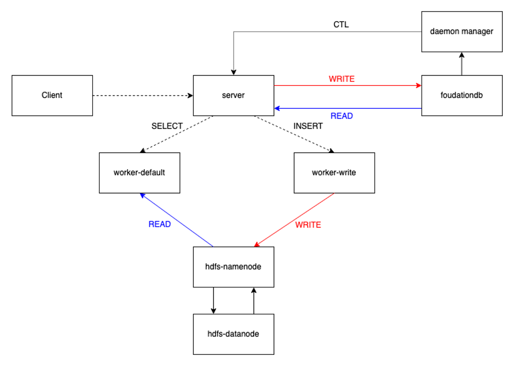

# Docker Playground

## Prerequisite

Before running, make sure your system has following prerequisite:

- docker
- docker-compose
- a docker runtime is up and running

**Important notes:** this repo has been thoroughly tested on: (1) MacOS Catalina (Intel Silicon), and (2) Debian 9. For other platforms, there're some known issues:

- FoundationDB docker cannot start on Apple Silicon machines
- FoundationDB docker cannot start on WSL

If you're using MacOS and cannot use docker desktop, you can:

1. Install `docker` and `docker-compose` with `brew install docker docker-compose`
2. Use [Colima](https://github.com/abiosoft/colima) to create a docker runtime env

## Cluster architecture

We are going to deploy a byconity cluster with following architecture:



Four byconity components are:

- server: manage databases and tables, interacting with client, coordinate workers to handle query
- worker-write: handle write (INSERT)
- worker-read: handle read (SELECT)
- daemon-manager: manage the background jobs (merge, kafka, etc...)

There could be more than one worker-write and worker-default, and they can be organized into a **virtual warehouse**. When a virtual warehouse have multiple worker-write, each write query will randomly select a worker to run. When a virtual warehouse have multiple worker-default, a select query will be parallelized among as much workers as possible.

In addition, there're following components in the cluster:

- foudationdb: a transactional kv database, all metadata of databases and tables will be stored here
- hdfs: include one namenode and one datanode, is the *primary* storage of all tables data

## Bring the cluster up

Checkout the byconity-docker code base

```
git clone git@github.com:ByConity/byconity-docker.git
cd byconity-docker
```

From the current directory, run:

```
docker-compose up
```

Wait until all containers are ready. By default, docker exposes the tcp port at 9000 and http port at 8123. We can use following commands to check the readiness of byconity components: 

```s
# return 1 indicates that server is working properly
curl '127.0.0.1:8123/?query=select%20count()%20from%20system.one'
# return 1 indicates that read worker is working properly and server can connect to it
curl '127.0.0.1:8123/?query=select%20count()%20from%20cnch(`vw_default`,system,one)'
# return 1 indicates that write worker is working properly and server can connect to it
curl '127.0.0.1:8123/?query=select%20count()%20from%20cnch(`vw_write`,system,one)'
```

## Trying some basic queries

Internally, byconity read/write to hdfs with username `clickhouse` (and data is stored in `/user/clickhouse/`), which is not created by default when starting hadoop cluster. We can use following commands to create the user `clickhouse` on hdfs.

```s
./hdfs/create_users.sh
```

We can use public clickhouse client to connect to byconity. If you don't have clickhouse on your system, you can quickly download it by:

On MacOS:

```
curl -O 'https://builds.clickhouse.com/master/macos/clickhouse' && chmod a+x ./clickhouse
```

On Linux:

```
curl -O 'https://builds.clickhouse.com/master/amd64/clickhouse' && chmod a+x clickhouse
```

Then connect to server by:

```s
./clickhouse client
```

We can use following queries to create a database, create a table, insert some data to table, and query from it:

```sql
CREATE DATABASE test;
USE test;
CREATE TABLE events (`id` UInt64, `s` String) ENGINE = CnchMergeTree ORDER BY id;
INSERT INTO events SELECT number, toString(number) FROM numbers(10);
SELECT * FROM events ORDER BY id;
```

If the system is working correctly, the select query should show a similar result as bellow:

```sql
SELECT *
FROM events
ORDER BY id ASC

Query id: b5c4bc8e-b768-432c-b24c-1aa98c5e512d

┌─id─┬─s─┐
│  0 │ 0 │
│  1 │ 1 │
│  2 │ 2 │
│  3 │ 3 │
│  4 │ 4 │
│  5 │ 5 │
│  6 │ 6 │
│  7 │ 7 │
│  8 │ 8 │
│  9 │ 9 │
└────┴───┘

10 rows in set. Elapsed: 0.015 sec. 
```

## A quick look into how the data is stored

In byconity, the metadata is stored on FoundationDB, while the actual data is store on HDFS. Let's take a look at both of them.

### Metadata

The metadata includes databases, tables, partitions, and parts. Here we only focus on how we store a part in FoundationDB. While you can use `fdbcli` to directly retrieve the data, we provide a system table `system.cnch_parts` to help you quickly query the metadata of a table:

```
┌─name─────────────────┬─type──────────────────────────────────────────────────────────────────────────────┬─flags─┬─default_type─┬─default_expression─┬─comment─┬─codec_expression─┬─ttl_expression─┐
│ database             │ String                                                                            │       │              │                    │         │                  │                │
│ table                │ String                                                                            │       │              │                    │         │                  │                │
│ table_uuid           │ UUID                                                                              │       │              │                    │         │                  │                │
│ partition            │ String                                                                            │       │              │                    │         │                  │                │
│ name                 │ String                                                                            │       │              │                    │         │                  │                │
│ bytes_on_disk        │ UInt64                                                                            │       │              │                    │         │                  │                │
│ rows_count           │ UInt64                                                                            │       │              │                    │         │                  │                │
│ columns              │ String                                                                            │       │              │                    │         │                  │                │
│ marks_count          │ UInt64                                                                            │       │              │                    │         │                  │                │
│ index_granularity    │ Array(UInt64)                                                                     │       │              │                    │         │                  │                │
│ commit_time          │ DateTime                                                                          │       │              │                    │         │                  │                │
│ kv_commit_time       │ DateTime                                                                          │       │              │                    │         │                  │                │
│ columns_commit_time  │ DateTime                                                                          │       │              │                    │         │                  │                │
│ mutation_commit_time │ DateTime                                                                          │       │              │                    │         │                  │                │
│ previous_version     │ UInt64                                                                            │       │              │                    │         │                  │                │
│ partition_id         │ String                                                                            │       │              │                    │         │                  │                │
│ bucket_number        │ Int64                                                                             │       │              │                    │         │                  │                │
│ outdated             │ UInt8                                                                             │       │              │                    │         │                  │                │
│ visible              │ UInt8                                                                             │       │              │                    │         │                  │                │
│ part_type            │ Enum8('VisiblePart' = 1, 'InvisiblePart' = 2, 'DropRange' = 3, 'DroppedPart' = 4) │       │              │                    │         │                  │                │
│ active               │ UInt8                                                                             │       │ ALIAS        │ visible            │         │                  │                │
│ bytes                │ UInt64                                                                            │       │ ALIAS        │ bytes_on_disk      │         │                  │                │
│ rows                 │ UInt64                                                                            │       │ ALIAS        │ rows_count         │         │                  │                │
└──────────────────────┴───────────────────────────────────────────────────────────────────────────────────┴───────┴──────────────┴────────────────────┴─────────┴──────────────────┴────────────────┘
```

Let's try to query all metadata of above example table:

```sql
SELECT
    name,
    rows,
    bytes,
    part_type
FROM system.cnch_parts
WHERE (database = 'test') AND (table = 'events')

Query id: 58c9113e-866f-4a9e-80ee-2d3283b2e4a8

┌─name───────────────────────────────────────────────────────────┬─rows─┬─bytes─┬─part_type───┐
│ all_438015441180033025_438015441180033025_0_438015441166663680 │   10 │  1012 │ VisiblePart │
└────────────────────────────────────────────────────────────────┴──────┴───────┴─────────────┘
```

### Remote data

You can open the hdfs at `localhost:9870` to see how the data is stored. Byconity store each data part as a single file name `data` and the path is `{disk_root}/{table_uuid}/{part_name}/`. In the above example, the data on hdfs is as follow:


Each table will have an UUID, and the path on hdfs is `{disk_root}/{table_uuid}`. Inside the table path, each part is stored in a single file name`data` and the path is `{disk_root}/{table_uuid}/{part_name}/`.


## SSB benchmark

The minimum requirement to run SSB 1G is each container has 1CPU and 1GB RAM. If you're using MacOS, you should config the Docker VM to have 2CPU and 8GB RAM.

SSB stand for *Star Schema Benchmark*. It contains four tables in a star-schema and one single flat table. The data is generated from a software. The total amount of data (a.k.a *scale*) can be chosen when generating. Scale 1 generates 6 million rows, while scale 1000 generates 6 billion rows. In this example, we use scale 1. To change the scale, you can change the generation command in the script.

To create the table and import data to it, from current directory run:

```
./datasets/ssb_import.sh
```

The script will create the table, generate the data, import it into byconity via clickhouse client, then create the flat table. When the importing done, you play with query in `datasets/ssb.sql`

```sql
SELECT
    sum(LO_REVENUE),
    toYear(LO_ORDERDATE) AS year,
    P_BRAND
FROM lineorder_flat
WHERE (P_BRAND = 'MFGR#2239') AND (S_REGION = 'EUROPE')
GROUP BY
    year,
    P_BRAND
ORDER BY
    year ASC,
    P_BRAND ASC

Query id: c8ed5cef-57dd-4d0e-adf8-ebea5d37d34e

┌─sum(LO_REVENUE)─┬─year─┬─P_BRAND───┐
│       732065331 │ 1992 │ MFGR#2239 │
│       665355617 │ 1993 │ MFGR#2239 │
│       733858503 │ 1994 │ MFGR#2239 │
│       622904542 │ 1995 │ MFGR#2239 │
│       628615052 │ 1996 │ MFGR#2239 │
│       784212754 │ 1997 │ MFGR#2239 │
│       409670997 │ 1998 │ MFGR#2239 │
└─────────────────┴──────┴───────────┘

7 rows in set. Elapsed: 0.270 sec. Processed 6.00 million rows, 64.56 MB (22.19 million rows/s., 238.76 MB/s.)
```

When testing the star schema, you may also try the cost-based optimizer by `set enable_optimizer=1` to get better performance in join queries:

Without CBO:

```sql
SELECT
    C_CITY,
    S_CITY,
    toYear(LO_ORDERDATE) AS d_year,
    sum(LO_REVENUE) AS revenue
FROM ssb.customer, ssb.lineorder, ssb.supplier
WHERE (LO_CUSTKEY = C_CUSTKEY) AND (LO_SUPPKEY = S_SUPPKEY) AND (C_NATION = 'UNITED STATES') AND (S_NATION = 'UNITED STATES') AND (d_year >= 1992) AND (d_year <= 1997)
GROUP BY
    C_CITY,
    S_CITY,
    d_year
ORDER BY
    d_year ASC,
    revenue DESC
FORMAT `Null`

Query id: 03cc9993-26f3-46b9-93fc-b108245d6d14

Ok.

0 rows in set. Elapsed: 46.525 sec. Processed 6.03 million rows, 84.22 MB (129.68 thousand rows/s., 1.81 MB/s.)
```

With CBO:

```sql
SELECT
    C_CITY,
    S_CITY,
    toYear(LO_ORDERDATE) AS d_year,
    sum(LO_REVENUE) AS revenue
FROM ssb.customer, ssb.lineorder, ssb.supplier
WHERE (LO_CUSTKEY = C_CUSTKEY) AND (LO_SUPPKEY = S_SUPPKEY) AND (C_NATION = 'UNITED STATES') AND (S_NATION = 'UNITED STATES') AND (d_year >= 1992) AND (d_year <= 1997)
GROUP BY
    C_CITY,
    S_CITY,
    d_year
ORDER BY
    d_year ASC,
    revenue DESC
FORMAT `Null`
SETTINGS enable_optimizer = 1

Query id: a6f92e6b-be44-4c47-b0e2-fa58f806bdec

Ok.

0 rows in set. Elapsed: 0.974 sec. 
```

## Clickbench

**Notes**: clickbench dataset size is about 45GB raw data and 14 (before optimize) or 11 (after optimize) in ByConity. Make sure you have enough resource before running

The minimum requirement to run Clickbench is each container has 2CPU and 8GB RAM. If you're using MacOS, you should config the Docker VM to have 4CPU and 8GB RAM. To have good performance, each container (except foudationdb) should has at least 4CPU and 16GB RAM.

Clickbench is a benchmark by ClickHouse, which contains 1 single flat table and the dataset of 100M rows. The dataset is obfuscated to have same data distribution as Yandex's production data. More about the benchmark [here](https://github.com/ClickHouse/ClickBench).

To create the table and import data to it, from current directory run:

```
./datasets/clickbench_import.sh
```

The script will create the table, download the dataset, decompress it and insert into byconity via clickhouse client. When the importing done, you can test with a simple query:

```sql
SELECT count()
FROM test.hits

Query id: 08970ad5-2753-40bc-9be2-e4bb7873f3a3

┌──count()─┐
│ 99997497 │
└──────────┘

1 row in set. Elapsed: 11.161 sec. Processed 100.00 million rows, 199.99 MB (8.96 million rows/s., 17.92 MB/s.)
```

Notes that in the first run, data need to be pulled from hdfs, so it takes long time. In the consequence run, the local cache hit and the execution is much faster:

```sql
SELECT count()
FROM hits

Query id: 1f6088a0-f9c6-4c23-a4be-b1c3b1b8cb6c

┌──count()─┐
│ 99997497 │
└──────────┘

1 row in set. Elapsed: 1.545 sec. Processed 100.00 million rows, 199.99 MB (64.71 million rows/s., 129.43 MB/s.)
```

You can try to play with the table with the query provided in `datasets/clickbench.sql`.
