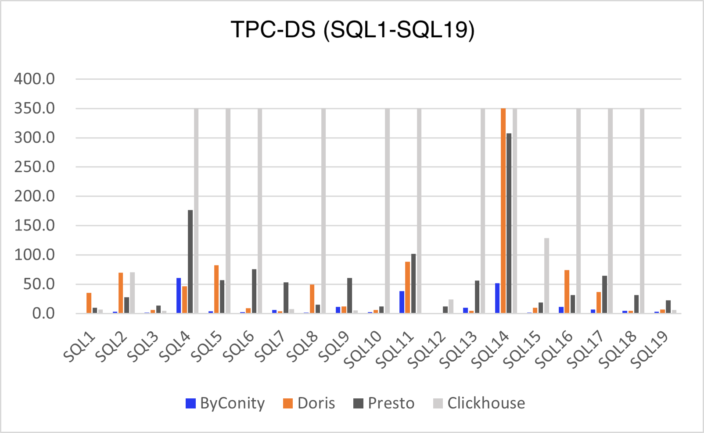
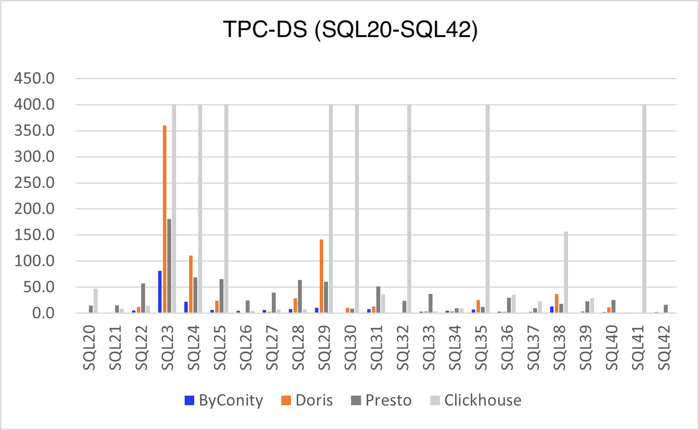
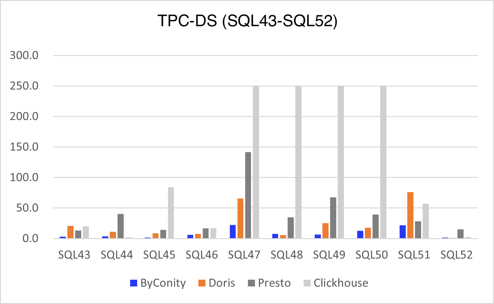
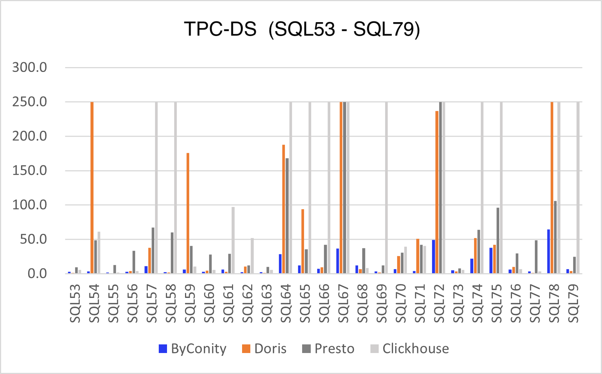
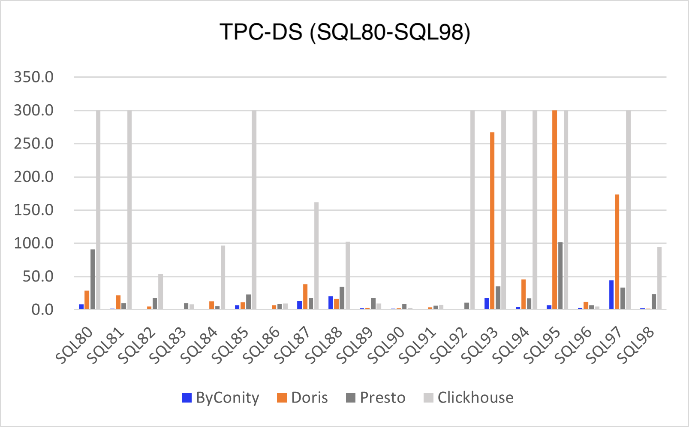

# Introduction
With the increasing amount and complexity of data, enterprises are increasingly turning to OLAP (On-Line Analytical Processing) engines to process large-scale data and deliver real-time analytical insights. Performance is a very important factor when choosing an OLAP engine. Therefore, this article aims to offer valuable insights by conducting a performance comparison among four prominent open-source OLAP engines: ClickHouse, Doris, Presto, and ByConity. To achieve this, we employ a set of 99 query statements sourced from the TPC-DS benchmark. Our aim is to provide reference for enterprises in their journey to select the most fitting OLAP engine for their specific needs.

# TPC-DS Benchmark Testing
TPC-DS (Transaction Processing Performance Council Decision Support Benchmark) is a benchmark for Decision Support Systems (DSS). The tool was developed by the TPC organization. It simulates multidimensional analysis and decision support scenarios and provides 99 query statements to evaluate the performance of the Database System in complex multidimensional analysis scenarios. Each query is designed to simulate complex decision support scenarios, including advanced SQL techniques such as joins across multiple tables, aggregation and grouping, and subqueries.

# OLAP Engines 
ClickHouse, Doris, Presto and ByConity are currently popular open source OLAP engines, all of which have the characteristics of high performance and scalability.
- ClickHouse is a columnar database management system developed by Russian search engine company Yandex, which focuses on fast querying and analysis of large-scale data.
- Doris is a distributed columnar storage and analytics system that supports real-time querying and analytics and integrates with Big data technologies such as Hadoop , Spark and  Flink .
- Presto is a distributed SQL query engine developed by Facebook for fast queries and analysis on large datasets.
- ByConity is an open source cloud native data warehouse developed by ByteDance, which adopts the architecture of storage and calculation separation, realizes tenant resource isolation, elastic volume expansion and contraction, and has a strong consistency of data read and write. It supports mainstream OLAP engine optimization technology and has excellent read and write performance.
This article will leverage these four OLAP engines to evaluate the performance of 99 distinct queries drawn from the TPC-DS benchmark. The objective is to compare their respective performance differences across various query types, and offer insights and findings from our evaluation on TPC-DS.

# Testing environment and methods
The testing environment was configured as follows:

| Testing Spec | Clickhouse | Doris | Presto | ByConity |
| ----------- | ----------- | ----------- | ----------- | ----------- |
| Environment Configuration | Memory:256GB| | | | |
| |Disk: ATA, 7200rpm,partitioned:gpt | | | | |
| |System: Linux 4.14.81.bm.30-amd64 x86_64, Debian GNU/Linux 9 | | | | |
| Test data Volume | 1TB data table equivalent to 2.80 billion rows of data | | | | |
|Package version | 23.4.1.1943 | 1.2.4.1 | 0.28.0 | 0.1.0-GA |
| Version release time | 2023-04-26 | 2023-04-27 | 2023-03-16 | 2023-03-15 |
| Number of nodes | 5 Workers | 5 BE , 1 FE | 5 Workers, 1 Coordinator | 5 Workers, 1 Server |
| Other configurations | distributed_product_mode = 'global'  partial_merge_join_optimizations = 1 | Bucket configuration: dimension table 1, returns table 10-20, sales table 100-200 | Hive Catalog， ORC format,  Xmx200GB | enable_optimizer=1, dialect_type='ANSI' |
|  |  |  |  |  |

**Server Configuration**

| Server Configuration||
| ----------- | ----------- |
| Architecture: | x86_64|
| CPU op-mode(s):        | 32-bit, 64-bit |
| Byte Order:           |  Little Endian
| CPU(s):             |    48
On-line CPU(s) list:  |  0-47
Thread(s) per core:   |  2
Core(s) per socket:   |  12
Socket(s):            |  2
NUMA node(s):        |   2
Vendor ID:            |  GenuineIntel
CPU family:           |  6
Model:                 | 79
Model name:            | Intel(R) Xeon(R) CPU E5-2650 v4 @ 2.20GHz
Stepping:           |    1
CPU MHz:              |  2494.435
CPU max MHz:          |  2900.0000
CPU min MHz:         |   1200.0000
BogoMIPS:            |   4389.83
Virtualization:      |   VT-x
L1d cache:           |   32K
L1i cache:           |   32K
L2 cache:            |   256K
L3 cache:             |  30720K
NUMA node0 CPU(s):   |   0-11,24-35
NUMA node1 CPU(s):    |  12-23,36-47

Testing method:
- Tested the performance of 4 OLAP engines with 99 queries and 1 TB (2.80 billion rows) of data using the TPC-DS benchmark.
- Use the same test dataset in each engine and maintain the same configuration and hardware environment.
- For each query, execute multiple times and average to reduce measurement errors, setting a timeout of 500 seconds per query.
- Record the details of query execution, such as query execution plan, I/O, and CPU usage.

## Performance test results
We conducted performance testing on these four OLAP engines using the same dataset and hardware environment. The dataset size was set at 1TB, and the detailed hardware and software specifications have been provided earlier in this report. To facilitate transparency and accessibility, we've shared the ByConity benchmark framework(https://github.com/ByConity/byconity-tpcds/blob/main/Practice.md) on GitHub.

Our testing involved running 99 query statements from the TPC-DS benchmark on each of the four OLAP engines. We performed three consecutive test runs and calculated the average results for each engine. Notably, ByConity successfully completed all 99 query tests. However, Doris encountered issues, crashing during SQL15 and experiencing timeouts in SQL54, SQL67, SQL78, and SQL95. Presto, on the other hand, only timed out in SQL67 and SQL72, while successfully completing all other query tests.

ClickHouse presented unique challenges as it managed to execute only 50% of the query statements. This performance discrepancy is attributed to potential limitations in effectively handling multi-table associated queries. It may require manual rewriting and query splitting for such SQL statements to execute. Consequently, for the purpose of comparing total execution times, we temporarily excluded ClickHouse from consideration. In Figure 1 below, we provide a visual representation of the total execution times for the remaining three OLAP engines.

Figure 1 illustrates that ByConity's open-source query performance superseds the other engines, achieving approximately 3-4 times faster execution times. (Please note that all units on the vertical axis of the subsequent charts are expressed in seconds).

For the 99 query statements in the TPC-DS benchmark, we will classify them according to different query scenarios, such as basic query, join query, aggregate query, subquery, window function query, etc. In the sections below, we will utilize these classification criteria to assess and compare the performance of the four OLAP engines: ClickHouse, Doris, Presto, and ByConity.

## Scenario 1: Basic query
In this scenario, we evaluate the performance of the four OLAP engines in handling fundamental query operations. The operations include retrieving data from a single table, applying filters, and sorting results. The primary focus of the basic query performance test is assessing how well each engine handles a single query. Among them, ByConity performs the best, with both Presto and Doris delivering commendable results. This success can be attributed to the fact that basic queries typically involve a limited number of data tables and fields, allowing Presto and Doris to leverage their distributed query capabilities and in-memory computing features effectively. However, ClickHouse faces some challenges in this regard, particularly with regards to multi-table associations. In certain cases, it encounters issues, with SQL5, 8, 11, 13, 14, 17, and 18 experiencing timeouts during testing. It's worth noting that our timeout threshold is set at 500 seconds, but for greater clarity, we've truncated the timeout limit to 350 seconds. Figure 2 below presents the average query times for the four engines in the basic query scenario:

## Scenario 2: Join query
Join queries represent a common multi-table query scenario where the JOIN statement is used to combine multiple tables and retrieve data based on specified conditions. As shown in Figure 3, we observe that ByConity excels in this scenario, primarily owing to its robust query optimizer optimization. ByConity benefits from the introduction of cost-based optimization capabilities (CBO), and the execution of re-order optimization operations during multi-table joins. Following closely behind, we have Presto and Doris, both delivering respectable results in handling multi-table join queries. However, ClickHouse exhibits comparatively weaker performance in multi-table joins when compared to the other three engines. It also faces limitations in its support for more complex statements.

## Scenario 3: Aggregate query
Aggregate queries involve statistical data calculations, typically encompassing the use of aggregation functions like SUM, AVG, COUNT, and more. In this scenario, ByConity continues to demonstrate strong performance, with Doris and Presto following suit. However, when it comes to handling aggregate queries, ClickHouse faced challenges, encountering timeouts on four occasions. To provide a clearer distinction, we've adjusted the timeout threshold to 250 seconds.

## Scenario 4: Subquery
Subquery, also known as nested queries in SQL, are typically used as a condition or constraint for the primary query. As illustrated in Figure 5 below, ByConity performs best because ByConity implements rule-based optimization capabilities (RBO) for query optimization, utilizing techniques such as operator pushdown, column clipping, and partition clipping. Complex nested queries are optimized comprehensively, replacing all subqueries and converting common operators into the form of Join + Agg. Following ByConity, we have Doris and Presto, which performed relatively well. However it's worth noting that Presto experiences timeouts in SQL68 and SQL73, while Doris encounters timeouts in three SQL queries. Clickhouse also experiences some timeouts and system errors, previously mentioned. To facilitate performance differences, we adjusted the timeout threshold to 250 seconds.

## Scenario 5: Window function
Window function query is an advanced SQL query scenario that enables operations such as ranking, grouping, sorting, and more within query results. As shown in Figure 6 below, ByConity has the best performance, followed by Presto. However, Doris encounters a timeout situation. Meanwhile, ClickHouse still faces challenges and hasn't completed the entire TPC-DS test in this scenario.

 !(./f1)

# Summary
In conclusion, this article analyzes and compares the performance of ClickHouse, Doris, Presto, and ByConity, four prominent OLAP engines, across aspectrum of 99 query statements from the TPC-DS benchmark test. We found that there are differences in the performance of the four engines under different query scenarios. ByConity performs well in all 99 query scenarios of TPC-DS, surpassing the other three OLAP engines. Presto and Doris exhibited their strengths in join queries, aggregate queries, and window function scenarios, contrasting with ClickHouse's performance, which showed some limitations in optimizing multi-table associative queries.
It should be noted that the performance test results depend on multiple factors, including data structure, query type, data model, etc. In practical applications, various factors need to be considered comprehensively to choose the most suitable OLAP engine.
When choosing an OLAP engine, factors such as scalability, ease of use, stability, etc. need to be considered.  In practical scenarios, tailoring the selection to meet specific business requirements and reasonably configuring and optimizing the chosen engine are crucial steps to attain optimal performance.
In short, ClickHouse, Doris, Presto, and ByConity are all excellent OLAP engines, each with its unique strengths and applicable scenarios. In practice, the choice should be guided by the specifics of the business needs, coupled with reasonable configuration and optimization. Moreover, selecting representative query scenarios and datasets and conducting comprehensive testing and analysis across different query scenarios is imperative for a holistic evaluation of engine performance.

# Join the Community
The ByConity community boasts a thriving user base and maintains a welcoming and inclusive atmosphere. We extend a warm invitation to everyone interested in engaging with us. You can join the conversation and collaborate with us on GitHub by visiting our issue at https://github.com/ByConity/ByConity/issues/26.