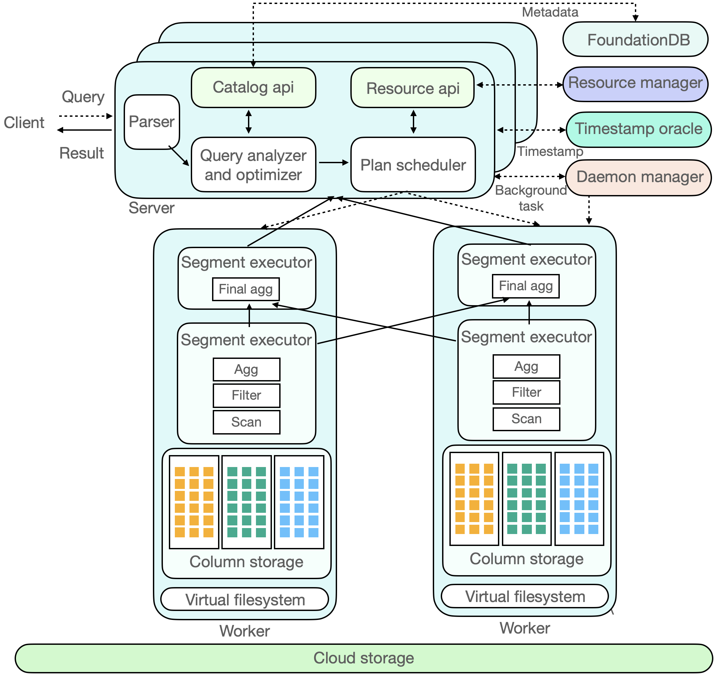

# Background and technical architecture

# Background

ByConity is a data warehouse system designed for modern IT architecture changes. It is designed with Cloud Native architecture. It provides excellent query and write performance while meeting the needs of data warehouse users for resource elastic volume expansion and contraction, read and write separation, resource isolation, and strong data consistency.

ByConity uses a large number of mature OLAP technologies, such as column storage engine, MPP execution, intelligent query optimization, vectorization execution, Codegen, indexing, data compression; it also makes technical innovations for the particularity of cloud scenarios and storage and calculation separation architectures. ByConity has openned source code to the community.

# Overall architecture

ByConity can be roughly divided into 3 layers: Service Access Layer, Computing Layer and Storage Layer. The service Access Layer responds to user queries, the computing layer is responsible for computing data, and the storage layer stores user data.

## Service Access Layer

ByConity 's service access layer accepts the user's query, first parses the query, and combines the catalog api to obtain Metadata information to generate an efficient execution plan, then obtains available computing resources through the Resource Manager, and finally schedules the query plan to a suitable (e.g., with cache) computing node for execution. The service access layer consists of one or more servers and supports horizontal expansion, serving as a response to user services and coordinating scheduling. In addition to user jobs, there are background tasks in ByConity, such as compaction/ gc , etc. These background tasks are managed by the Daemon manager and dispatched to the corresponding server for execution.

The query optimizer is one of the cores of the ByConity system. An excellent optimizer can greatly improve query performance. Especially in complex query scenarios, the optimizer can improve performance by several to hundreds of times. ByConity's self-developed optimizer provides extreme optimization capabilities based on four major optimization directions (rule-based, cost-based, data-dependence-based, and histroy-based).

## Computing Layer

ByConity 's computing layer consists of one or more Virtual Warehouse, and different tenants can use different Virtual Warehouse to achieve physical resource isolation. Resource Manager is responsible for unified management and scheduling of computing resources, and can collect performance data and resource usage of each Virtual Warehouse, dynamically allocate resources for query, write and background tasks, and perform dynamic volume expansion and contraction to improve resource utilization rate.

A Virtual Warehouse consists of multiple workers. After each node receives the PlanSegment, it starts to drive the execution of the PlanSegment. The PlanSegment containing the data source starts to read the data, and distributes the data to each downstream node according to certain shuffle rules. The PlanSegment containing exchange input waits for the upstream data. If there is a need to continue shuffle, it will continue to send the data to each node. After multiple rounds of stages are completed, the results will be returned to the server level.

## Data Storage Layer

ByConity 's metadata and data are stored separately. Metadata is stored in a distributed key-value store, and data is stored in a distributed file system or object store .

### Metadata Storage

ByConity 's Metadata storage implements a common catalog api based on a high-performance distributed key-value store (FoundationDB), making the backend pluggable and easy to expand and adapt to other key-value stores. ByConity also implements complete transaction semantics ( ACID ) support on the upper layer of the catalog api, providing efficient and reliable Metadata services and ensuring high data quality.

### Data storage

ByConity uses cloud storage services such as HDFS or S3 as the data storage layer to store actual data, indexes, etc. The data files of the data table are stored in the remote unified distributed storage system and are separated from the computing nodes. ByConity implements a common layer of virtual file system api on top of the remote distributed storage system, which is convenient for the underlying expansion and adaptation to different storage backends, such as HDFS, Amazon S3, Google cloud storage, Azure blob storage, Alibaba Cloud object storage and so on.

Similar to mainstream analytical data, ByConity adopts a columnar storage format to reduce unnecessary data IO to improve query performance, and efficiently compress data to reduce storage costs. In addition, for continuously stored columnar data, ByConity further improves query performance through vectorized execution technology.
