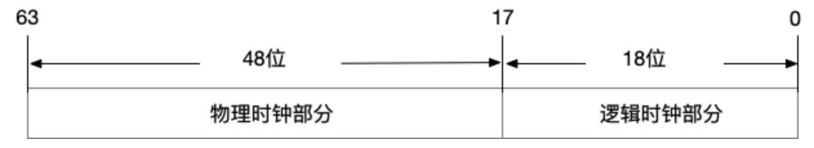
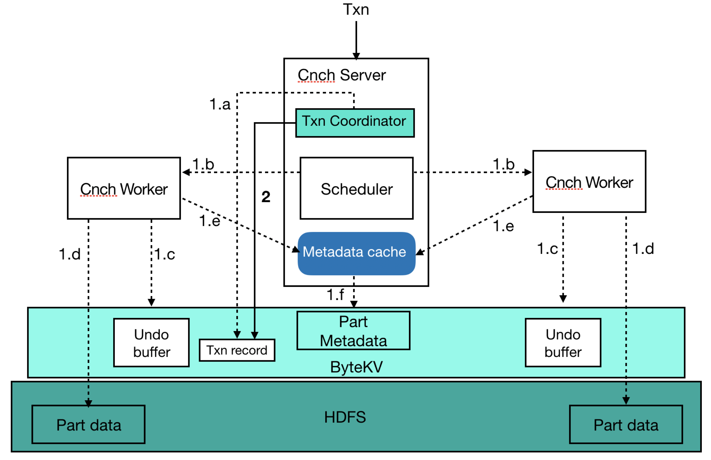
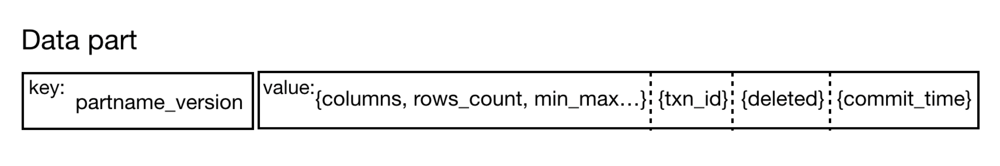

# 事务和并发控制

### 事务概览

在 ByConity (曾用内部代号 CNCH) 里，为了保证数据质量，我们提供了事务语义的支持。每条 SQL 语句都会转换为一个事务去执行，事务提供了原子性、一致性、隔离性和持久性 (ACID) 属性的保证，旨在在并发读写，软件异常，硬件异常等各种情况下仍然可以保证数据的正确性和完整性。

- 原子性（Atomicity）保证每一个事务被视为一个单元，事务要么完全成功要么彻底失败。在事务成功之前，写入的数据不可见，不会出现部分数据可见的情况。事务失败之后，会把写入的部分数据自动清理掉，不会导致垃圾数据的残留。ByConity 在各种情况下都会保证原子性，包括掉电，错误和宕机等各种异常情况。
- 一致性（Consistency）保证数据库只会从一个有效的状态变成另外一个有效的状态，任何数据的写入必须遵循已经定义好的规则。
- 隔离性（Isolation）确保数据库 SQL 并发执行（例如，同一时刻读写同一张表）的正确性，确保数据库的状态在并发场景下能等价于某种顺序执行的状态，事务之间互不影响。隔离性是并发控制的目标，可以有多种隔离级别的实现，ByConity 为用户提供的是 read committed（rc）隔离级别的支持。未完成的事务的写入对于其他事务是不可见的。
- 持久性（Durability）保证数据的高可用性。一旦事务成功提交，其写入的数据会被持久化，即使在出现各种系统 failure 的情况下不丢失。ByConity 采取的存储计算分离结构，利用了成熟的高可用分布式文件系统或者对象存储（例如 hdfs，S3），保证成功事务所提交数据的高可用。

### 元数据存储选型

ByConity 是一款分析型数据库（OLAP），与传统的关系型数据库（OLTP）在事务上的需求是不同。分析型在事务上的诉求是针对高吞吐低延迟的场景；相反，OLTP 数据库的诉求是面向高 QPS 实时的场景。

除了基本的 ACID 属性需要保证，ByConity 在事务实现选型上主要有 3 个特别的需求。首先，ByConity 单个事务可能涉及到海量数据（例如，上亿行级别），事务对数据吞吐和写入性能有较高要求，并且需要保证其原子性；其次，分析型数据库的 workload 中读的比例高于写，事务需要保证读 workload 不会被写 workload 影响和阻塞；最后，事务需要具备灵活可控的并发控制的功能，ByConity 里除了需要处理用户侧并发的 workload，还需要处理并发的后台任务。

ByConity 的事务处理主要是对用户数据的元数据进行管理，元数据包括用户的 db（数据库元数据），table（数据表元数据）和 part（part 是数据文件的元数据，包括了 part 名字，columns，行数，状态，版本，提交时间等信息）。随着数据的增长，元数据本身数量级也会线性增长，不能丢失并且需要高可用，所以需要一个分布式存储或分布式数据库的方案。我们选择了成熟的分布式 Key-value 数据库 作为 ByConity 中上述元数据的存储方案，通过抽象元数据读写 API，后端适配苹果公司开发的 FoundationDB。

### 分布式时钟

事务在分布式系统中的执行需要在分布式不同节点中进行时钟同步。ByConity 采取了简单实用的 Timestamp Oracle（TSO）方案。其优点首先简单易懂，采取中心授时，能够确定唯一时间。然后是性能好，通常一个 tso 节点能支持 1m+ 的 QPS。缺点是不适合跨数据中心的场景，所有事务从 TSO 获取时间延迟较高。由于 TSO 是中心化授时方案，ByConity 为其提供了高可用服务。

TSO 使用混合逻辑时钟，时钟由物理部分和逻辑部分组成，64 位表示一个时间。为了避免 TSO 宕机导致的时间戳丢失，需要对时间戳持久化。但是如果每次授时都持久化将会降低性能，所以 TSO 会预申请一个可分配的时间窗口（例如 3s）申请成功之后，TSO 可以在内存中直接分配 3 秒窗口之内的所有时间戳。客户端请求时间戳，逻辑时钟部分随着请求递增。如果出现逻辑部分溢出情况，会睡眠 50ms 等待物理时钟被推进。TSO 会每 50ms 检查时钟，如果当前 TSO 的物理时钟已经落后于当前时间，需要更新 TSO 的物理时钟部分为当前物理时间。如果逻辑时钟部分过半，也会增加 TSO 的物理时钟，一旦物理时钟增长，逻辑时钟清零。如果当前时间窗口已经用完，需要申请下一个时间窗口。同时更新持久化的窗口上界。



### 事务处理

- Atomicity（原子性）

ByConity 单个事务在元数据管理上有高吞吐读写的需求，由于分布式 key-value 数据库（例如 FoundationDB）对单次原子写入的 value 都有大小限制（例如 10MB），ByConity 自己在分布式 key-value 存储之后实现了 2 阶段，使得单次写入大小不受限并且更加灵活可控。在第一阶段可以分批多次写入任意数据，并且不可见。第二阶段对事务进行提交，提交成功之后所有写入的数据同时可见。下面以一个 insert sql 为例，描述了 2 阶段原子提交的一个详细流程。

- 阶段 1
- 1. a: 在 kv 里写入事务记录（txn record），唯一标识当前事务；
- 1. b: 解析 insert sql 并执行；
- 1. c: 在远端文件系统或者对象存储写入数据之前，先把要写入数据的位置信息写入 undo buffer（供失败情况下清理使用）；
- 1. d: 把数据写入到远端文件系统或者对象存储；
- 1. e: 提交数据的元信息 part，写入到 kv 中；
- 阶段 2
- 提交事务，并更新事务记录的提交时间；
- 异步更新 part 数据的提交时间为事务的提交时间（part 未更新提交时间之前，需要反查事务记录的提交时间）；



```
                                                       事务提交详细流程图
```

- Consistency（一致性）

ByConity 选择的分布式 key-value 存储系统，ByteKV 和 Foundation 已经提供了一致性的支持，直接复用即可。

- Isolation（隔离性）

ByConity 对用户提供 Read Committed（RC）隔离级别的支持。每个事务初始化的时候会从 TSO 服务获取一个时间戳（timestamp）作为其 ID 和开始时间，提交的时候会再从 TSO 服务获取一个提交时间，在事务提交的时候更新 KV 里事务记录的提交时间并异步更新 part 的提交时间。读事务可以读取到已经提交成功（对应事务提交即成功）并且提交时间小于读事务开始时间的 part 元数据信息，从而实现 RC 语义。相比更加严格的隔离级别，RC 隔离级别可以最大化读性能。而更严格的隔离级别例如 Serializable Snapshot Isolation（SSI），读可能会被写入 block。

- Durability（持久性）

ByConity 元数据持久到 FoundationDB 中，分布式 Key-value 存储的特性提供了持久化和高可用的保障。

### 并发控制

ByConity 利用多版本和锁来保证并发读写场景下数据的正确性。ByConity 除了来自用户的 workload，内部还有后台任务（merge/alter 任务和唯一键表的去重任务）的并发读写需要处理。ByConity 选择了 RC 隔离级别，对于新的写入（例如 insert），由于不可见，可以无锁执行。对于已有数据，在并发读写时，需要进行并发控制。对于并发读和写这种场景，ByConity 利用多版本解决了读和写冲突，提供了读写性能。对于并发写的场景（例如 merge 和唯一键表的去重任务），利用了加锁来保证数据的正确性。

#### 多版本

每个 part 的元数据除去其原有基本信息之外，都有一个对应的版本（version），每次对已有数据进行变更，都会产生一个新的版本，而不是直接在原有数据上进行更新。对于 RC 隔离级别，已经开始的读事务，仍然继续读取旧的版本，新版本对其不可见，这样读和写互相不影响，最大化读写性能。



#### 锁

- 分布式 KV 锁

ByConity 对于 DDL 提供了全局 KV 排他锁避免并发的对 table schema 进行变更，分布式 kv 锁是全局共享，不同的节点都可以共享。

- 内存读写锁
- 支持共享锁和排他锁
- 支持等待
- 支持不同粒度

ByConity 提供了多级细粒度 DML 读写锁的支持，DML 相关的任务可以根据需求在不同粒度持不同类型的锁。

```
        Table
       /      \
      bucket   \
      /         \
   partition   partition

```

### 垃圾回收

ByConity 对于不可见的 part 和版本会定期进行回收，例如 merge 任务生成新的 part 之后，对于旧的 part，当不再被查询引用之后，就会进行回收，释放空间，降低成本。
