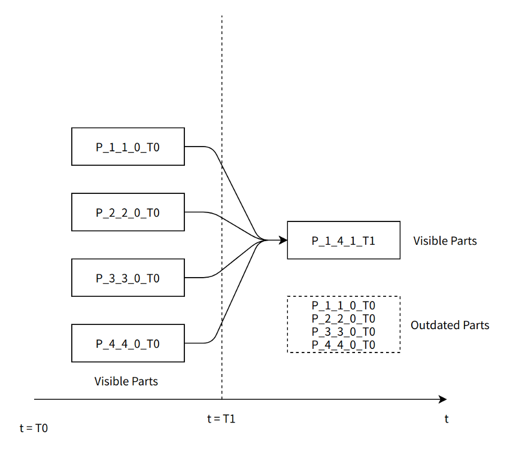
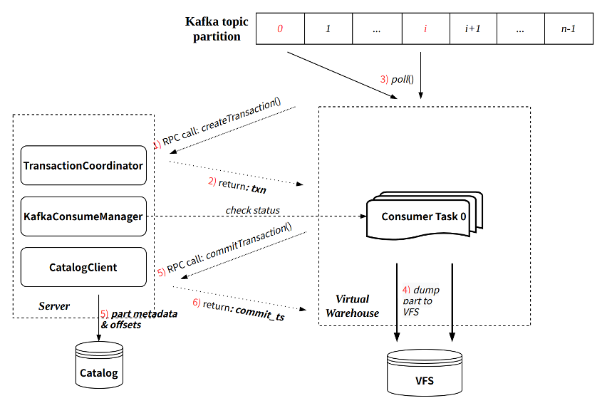

# 管理后台任务

文档类型：教程型

文档结构：教程目的，前置准备，分步骤讲解原理 & 示例，相关文档推荐；

内容提要：

1. 常见的后台任务有哪些，分别是什么作用
2. 如何手工启动和终止后台任务
3. 常见报错应该如何处理

ByConity 复用了[社区 ClickHouse MergeTree](https://clickhouse.com/docs/en/engines/table-engines/mergetree-family/mergetree/) 的经典设计，意味着在数据写入时以 Part 粒度进行存储，并保证每个 Part 内部的数据有序性，执行查询时并行处理多个 Part。后台 Merge 线程将多个 Part 不断合并成更大的 Part，不仅能减少 Part 数量，也能实现更大范围的数据有序性，是持续提升查询性能的关键操作。

## 常用后台任务

**MergeMutate 后台任务：**由于 ByConity 是存储计算分离架构，Part 不再属于某个固定的节点，每个 Part 可以被任意的计算节点处理，因此每个计算节点并不像社区 ClickHouse 一样运行专门的 Merge 和 Mutate 线程。取而代之地，我们在 Server 组件上为每个表创建一个 Merge 和 Mutate 后台任务，由该任务来统一管理和调度对应表的所有 Merge 和 Mutate 任务。

**GC\*\***后台任务：\*\*把多个 Part 合并成一个新的 Part，意味着原有的 Part 将不再被使用，及时删除这些被淘汰的 Part 有助于节省存储空间。为此我们为每个表运行一个专门的 GC（垃圾回收 Garbage Collection）后台任务，负责该表的过期 Part 的发现和删除。

**CONSUMER 后台任务：**基于 ByConity 的云原生新架构，在实时导入消费（aka CnchKafka）上做了新的设计与实现：

- 基于每张 Kafka 消费表在 server 段常驻执行一个 CONSUMER 后台任务（ConsumeManager）；
- CONSUMER 后台任务负责读取 Kafka 元信息，并将 partition 分配给各个 consumer task，然后将 task 任务分发到 worker 节点执行；
- 同时，CONSUMER 任务需要维持与 task 的心跳，保证每个 consumer task 处于正常的工作状态。

在设计上，Merge 和 GC 是两个独立的过程。我们在一个 Merge 任务完成之后，不会立即将旧 Part 删除，而是对应的为每个旧 Part 生成一个淘汰标记，等待后续 GC 任务统一处理。这样的设计能：

- 保持 Part 生命周期的一致性，查询执行过程不会出现“正在使用一个被删除的 Part”的不一致行为。
- 避免大量零碎的元数据和存储访问操作。Merge 完成时立即删除旧 Part 意味着大量零碎的 IO 操作，使得操作变得低效，也容易影响其他流程的正常执行。
- 更简单的实现。无需过多考虑 Merge 任务状态和 Part 状态间的一致性。


图 X-1

## MergeMutate 后台任务

MergeMutate 后台任务主要负责：选择合适的 Part 生成对应的 **Merge 任务(Merge Task)**、选择合适的 part 生成 **Mutate 任务(Mutate Task)**，并将生成的 Task 下发给合适的 Worker 执行以及最终提交和更新 Part 状态。

Merge 和 Mutate 实际上是两种不同的任务。

Merge 任务是选择一些较小 parts 合成一个比较大的 part，以减少查询时访问的文件数量，从而降低查询所需要的时间。

Mutate 任务则是对 part 中的某些列执行变更(Modify column, Drop column 等)。Mutate 任务由 Alter query 生成的，对于一个 Alter query，我们可以将其拆分成两部分，一是修改表的 schema 操作，二是如果需要对数据做变更，则会生成一个 Mutate Task 由后台任务执行数据修改操作。

### Merge 任务 Part 的选择

ByConity 从设计之初就要求能用一套系统同时处理不同场景和不同规模的业务：实时表和离线表共存、超大规模表和小表共存、宽表和窄表共存等、复杂字段和简单字段共存。这样复杂的应用场景意味着各个表的 Part 在大小、时效性、有序性等各方面都没有统一的规律可循。为此，我们设计并实现了一个自适应的 Part 选择策略。其大致流程如下：

- 为每个分区（Partition）维护其最新的数据写入时间、Part 的总数量和总大小。
- 首先从所有分区中选择一批分区，用户可以为每个表指定自己倾向的策略：按写入时间排序；按 Part 数量排序或轮训。
- 对选出的每个分区，扫描其所有 Part，按照 Part 的行数、大小、写入时间等信息，计算相互合并的收益大小，并最终按收益顺序选出多组 Part。
- 最后，对于每个被选择的分区，如果最后没有从该分区选出收益高的 Merge 任务，则在后续一段时间内将不再选择该分区，以实现自适应的调整。


图 X-2

如图，在选择 Partition 阶段，我们选择了 Partition 1 （Part 数量最多）和 Partition 2（最新数据写入）。然后从这两个 Partition 中计算 Part 间合并收益，最终选出三组 Part：p11~p12、p13~p16 以及 p23~p24。

（TODO: 补充一个 partition 没选出结果的例子？）

### 任务调度管理

对于上述选出的每组 Part，我们将预估其任务开销，如所需磁盘大小、占用内存大小等信息。然后通过<u>Resource Manager</u>（注：link to RM） 为此任务选择最合适的 Worker，并下发执行。

Worker 执行任务时，通过存储层所提供的接口，获取所需 Part。Worker 上 Part 的合并流程和社区 ClickHouse 原理类似。

Merge 任务执行完成后，Worker 向 Server 返回成功执行的标志。此后，Server 即可对新生成的 Part 进行提交，并对被合并的源 Part 进行标记，等待后续 GC 后台任务处理。

### 心跳机制

由于 MergeMutate 任务执行时间可能会比较久，所以我们需要通过心跳机制去检测 Worker 上的任务是否已经失败或者 Worker 是否已经宕机，以及时移除 Server 上已经失败的任务。同时 Worker 端也会在执行任务时通过上一次同步心跳的时间来判断 Server 是否已经宕机，从而提前结束任务避免浪费资源。

## GC 后台任务

### Part 可见性判断

区别于社区的 Part 可见性判断，ByConity 为了更好的实现 MVCC(Multi-Version Concurrency Control)特性，对 part 的可见性判断做了一些调整。

首先简单介绍写 part 的命名结构，part 命名如下图：


1. 社区版本 Part 可见性判断，以 Merge 任务为例



1. ByConityPart 可见性判断 (TODO)

### GC Task

理解<u>Merge</u>的作用和流程以及 Part 可见性规则之后，就能更好的理解 GC 工作机制。

如图 X-1，每个表的 GC 后台任务独立运行，它主要负责发现和删除 Merge 任务产生的淘汰 Part。

Server 对一个被淘汰的 Part 进行标记时，并不改变该 Part 的任何状态，而是生成一个新的与之对应的标记 Part，标记 Part 不占用实际的存储空间。这样做能保证所有 Part 在整个生命周期的**不变性（immutability）。**

基于图 X-2，在 Merge 完成将变成如下图 X-3 的状态：


GC 后台任务运行时，和 Merge 后台任务类似，

- 会按照 Part 总数量和总大小顺序选择一批 Partition。
- 然后扫描 Partition 内所有 Part，对被标记覆盖的 Part（即蓝色部分）执行删除操作。
- 然后再次扫描 Partition 内所有 Part，对标记 Part（即红色部分）执行删除操作。

## CONSUMER 任务

ByConity 继承了社区 Kafka 消费的基本设计，并基于云原生新架构设计并实现了全新的消费表引擎 CnchKafka。基本消费原理与社区保持一致，通过一个 <CnchKafka 消费表、Materialized View 物化视图表、存储表 > 三元组实现整个消费链路，其中：

- CnchKafka 消费表：负责订阅 Kafka topic 并消费消息；将得到的消息解析后写为 Block；
- Materialized View 物化视图表：构建从消费表到存储表的数据通路，将 CnchKafka 消费的 Block 写入存储表，并提供简单的过滤功能；
- 存储表：支持 Cnch 多种 MergeTree 存储表。

基本数据通路如下：


图中各组件是 ByConity 涉及 CnchKafka 的组件，具体组件说明请参考架构文档。

### KafkaConsumeManager

每张 CnchKafka 消费表会在 Server 层启动一个 Manager（即 CONSUMER 类型后台任务）负责调度和管理所有的消费者任务。Manager 本身是 Server 端的一个常驻线程，通过 Server 的高可用和 DaemonManager 保证其服务稳定。

KafkaConsumeManager 主要实现和功能包括：

- 根据配置的 consumer 数目将 topic partition 均匀分发到每个 consumer；
- 与 Catalog 交互，获取 partition 消费的 offset；
- 调度 consumer 到配置的 Virtual Warehouse 节点执行：
- 节点选择支持多种策略配置，保证负载均衡；
- 定期探活每个 consumer 任务，保证任务执行的稳定性。

### KafkaConsumer

每个 KafkaConsumer 实现为一个常驻线程在 Virtual Warehouse 节点执行，负责从指定的 topic partition 消费数据，转换为 part 写入 VFS，并将元信息提交回 Server 端写入 Catalog。主要特点：

- 继承社区的攒批写入模式（每次消费周期默认 8 秒）；
- 每次消费过程通过 Transaction 保证原子性：
- 通过与 Server RPC 交互创建事务；
- 事务提交会同时提交写入的 part 元信息以及最新消费的 offset。

单次消费执行流程可参考下图：



### Exactly-Once

与社区实现相比，CnchKafka 实现增强了消费语义，即从社区的 At-Least-Once 语义，升级为 Exactly-Once 语义。这主要得益于新架构 Transaction 事务的保证。

由于每轮消费都会通过事务管理，且每次提交数据元信息的同时提交对应的 offset。由于事务保证了提交的原子性，那么数据元信息和 offset 要么同时提交成功，要么都提交失败。

这样就保证了数据和 offset 始终一致，每次消费重启都从上次提交的 offset 位置继续消费，从而实现了 Exactly-Once。

### 自动容错实现

CnchKafka 整体容错策略采取**快速失败**方式，即：

- KafkaConsumeManager 定期探活 consumer 任务，探活失败，立即拉起一个新的 consumer；
- KafkaConsumer 每次执行中，与 Server RPC 的两次交互（创建事务和提交事务）都会向 Manager 校验自身的有效性，如果校验失败（比如 Manager 已经拉起了一个新的 consumer 等），会主动 kill 自己。

### 修改消费参数

支持通过 ALTER 命令快速修改 Setting 参数，主要用于调整消费者数目等提升消费能力。

命令：

```
ALTER TABLE <cnch_kafka_name> MODIFY SETTING <name1> = <value1>, <name2> = <value2>

```

该命令执行会自动重启消费任务。

### 手动启停消费

在一些场景中用户可能需要手动停止消费，随后手动恢复；我们提供了对应的 SYSTEM 命令实现：

```
SYSTEM START/STOP/RESTART CONSUME <cnch_kafka_name>

```

注意：START/STOP 命令会将对应状态持久化到 Catalog，因此在执行 STOP 命令后，如果不执行 START，即使服务重启，消费任务也不会恢复。

## 控制后台任务

提供 system 命令控制后台任务的开启与关闭，与社区不同的是，通过 system 命令控制是持久化操作，已经停止的后台任务不会在 server 重启后重新调度。

提供系统表 system.bg_threads 查看后台任务的状态，包括线程状态，调度次数，调度异常信息等。

```
SYSTEM STOP/START/RESTART CONSUME db.table;
SYSTEM STOP/START MERGES/GC db.table;
SELECT * FROM system.bg_threads WHERE database = 'db' AND table = 'table';
```

## 常见报错

1. Connection Refused from DaemonManager

```
Code: 5038. DB::Exception: Received from 127.0.0.1:9000. DB::Exception: 112:[E111]Fail to connect Socket{id=1155 addr=127.0.0.1:10090} (0x0x7f2f9674f6c0): Connection refused [R1][E112]Not connected to 127.0.0.1:10090 yet, server_id=1155 [R2][E112]Not connected to 127.0.0.1:10090 yet, server_id=1155 [R3][E112]Not connected to 127.0.0.1:10090 yet, server_id=1155.

```

具体报错信息如上，其中 10090 为 DaemonManger 的 rpc 端口，则说明 DaemonManager 组件连接失败，需检查 DaemonManager 的状态。
