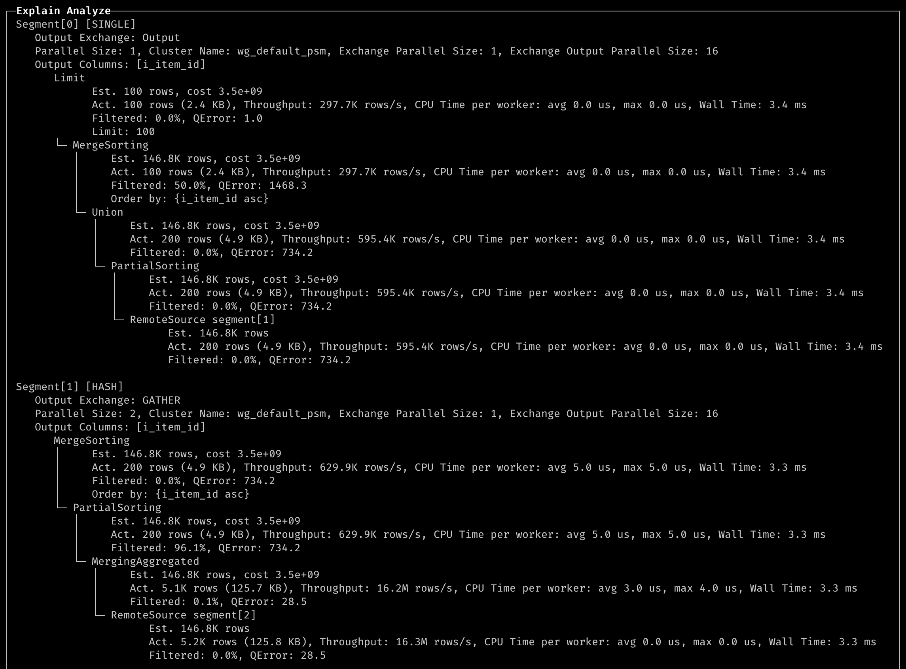

# 查询优化器

优化器是数据库系统的核心，优秀的优化器能极大提高查询性能，特别是在复杂查询场景下优化器能带来数倍至数百倍的性能提升。

ByConity 自研优化器基于四个大的优化方向提供极致优化能力：

- RBO：基于规则的优化能力。支持：列裁剪、分区裁剪、表达式简化、子查询解关联、谓词下推、冗余算子消除、Outer-JOIN 转 INNER-JOIN、算子下推存储、分布式算子拆分等常见的启发式优化能力。
- CBO：基于代价的优化能力。支持：Join Reorder、Outer-Join Reorder、Join/Agg Reorder、CTE、物化视图、Dynamic Filter 下推、Magic Set 等基于代价的优化能力。并且面向分布式计划融合了 Property Enforcement。
- DBO：基于数据依赖的优化能力。支持：唯一键、functional dependency、Order dependency、Inclusion dependency 等基于数据依赖关系的优化能力。
- HBO：基于查询反馈的优化能力。支持：基数估计动态调整、并行度动态调整、执行计划动态调整等基于历史执行反馈的优化能力。

# Turn on Query Optimizer

set dialect_type ='ANSI' or set enable_optimizer =1

If turn on ANSI mode, the optimizer will be turned on automatically.

# Commands for collecting, displaying and deleting statistical information

## Syntax Definition

- Subsequent versions will have automatic collection, update and analysis of statistical information

```
-- NOTE: ALL means currentDatabase().*

--    specifying columns and sample config is supportted
CREATE STATS [IF NOT EXISTS] (<db>.* | ALL | [<db>.]<table>['(' <col1>, <col2>, ..., <coln> ')']) [WITH (FULLSCAN | SAMPLE [<rows> ROWS] [<ratio> RATIO])]

-- Delete statistics
--   specifying columns is supported
DROP STATS (<db>.* | ALL | [<db>.]<table>['(' <col1>, <col2>, ..., <coln> ')' ])

--   specifying columns is supported
SHOW (STATS|COLUMN_STATS) (<db>.* | ALL | [<db>.]<table>'('<col1>, <col2>, ..., <coln> ')' )

```

## Syntax Example:

### Create Statistics

```

-- create stats for all table in current database which has no statistics
create stats if not exists all;
-- create stats for all table in db1 which has no statistics
create stats if not exists db1.*;

-- create stats for t1.c1,
create stats t1(c1);
-- create stats for t1.c1, t1.c2,
create stats t1(c1, c2);

-- create stats on t1, force to use fullscan,
-- otherwise controlled by statistics_enable_sample
create stats t1 with fullscan
-- sample MAX(**statistics_sample_row_count**, 0.01 * full_rows_count) rows when create stats for each table
create stats all with 0.01 ratio;
-- sample MAX(40000000, 0.01 * full_rows_count) rows when create stats for each table
create stats all with 0.01 ratio 40000000 rows;
-- sample with default settings,
-- controlled by **statistics_sample_row_count** and **statistics_sample_ratio
create stats all with sample;

```

### Show Statistics

```

-- show table statistics for all tables in current database
show stats all;
-- show table statistics for all tables in db1
show stats db1.*;
-- show table statistics for table t1
show stats t1;
-- show column statistics for table t1
show column_stats t1;

-- show column statistics for column c1, c2 of table t1
show column_stats t1(c1, c2);

```

### Drop Statistics

```

-- show statistics for all tables in current database
drop stats all;
-- show statistics for all tables in db1.*
drop stats db1.*;
-- show statistics for table t1
drop stats t1;


-- drop statistics for column c1, c2 of table t1
drop stats t1(c1, c2);

```

# Usage of Explain

## Explain

- Explain + SQL

```
EXPLAIN
WITH
    (
        SELECT
            sr_customer_sk AS ctr_customer_sk,
            sr_store_sk AS ctr_store_sk,
            sum(sr_return_amt) AS ctr_total_return
        FROM store_returns
        , date_dim
        WHERE (sr_returned_date_sk = d_date_sk) AND (d_year = 2000)
        GROUP BY
            sr_customer_sk,
            sr_store_sk
    ) AS customer_total_return
SELECT c_customer_id
FROM customer_total_return AS ctr1
, store
, customer
WHERE (ctr1.ctr_total_return >
(
    SELECT avg(ctr_total_return) * 1.2
    FROM customer_total_return AS ctr2
    WHERE ctr1.ctr_store_sk = ctr2.ctr_store_sk
)) AND (s_store_sk = ctr1.ctr_store_sk) AND (s_state = 'TN') AND (ctr1.ctr_customer_sk = c_customer_sk)
ORDER BY c_customer_id ASC
LIMIT 100

```

- Result of Explain


## **Explain Analyze**

Explain analyze + SQL

```
EXPLAIN ANALYZE LOGICAL
WITH customer_total_return AS

    (
        SELECT
            sr_customer_sk AS ctr_customer_sk,
            sr_store_sk AS ctr_store_sk,
            sum(sr_return_amt) AS ctr_total_return
        FROM store_returns
        , date_dim
        WHERE (sr_returned_date_sk = d_date_sk) AND (d_year = 2000)
        GROUP BY
            sr_customer_sk,
            sr_store_sk
    )
SELECT c_customer_id
FROM customer_total_return AS ctr1
, store
, customer
WHERE (ctr1.ctr_total_return >
(
    SELECT avg(ctr_total_return) * 1.2
    FROM customer_total_return AS ctr2
    WHERE ctr1.ctr_store_sk = ctr2.ctr_store_sk
)) AND (s_store_sk = ctr1.ctr_store_sk) AND (s_state = 'TN') AND (ctr1.ctr_customer_sk = c_customer_sk)
ORDER BY c_customer_id ASC
LIMIT 100

```

```
┌─Explain Analyze──────────────────────────────────────────────────────────────────────────────────────────────────────────────────────────────────────────────────────┐
│ Limit                                                                                                                                                                │
│ │     Est. 100 rows, cost 8.2e+05                                                                                                                                    │
│ │     Act. 100 rows (2.4 KB), Throughput: 545.0K rows/s, CPU Time per worker: avg 2.0 us, max 2.0 us, Wall Time: 1.8 ms                                              │
│ │     Filtered: 0.0%, QError: 1.0                                                                                                                                    │
│ └─ MergeSorting                                                                                                                                                      │
│    │     Est. 49.2K rows, cost 8.2e+05                                                                                                                               │
│    │     Act. 100 rows (2.4 KB), Throughput: 545.0K rows/s, CPU Time per worker: avg 2.0 us, max 2.0 us, Wall Time: 1.8 ms                                           │
│    │     Filtered: 96.9%, QError: 504.1                                                                                                                              │
│    └─ Union                                                                                                                                                          │
│       │     Est. 49.2K rows, cost 8.2e+05                                                                                                                            │
│       │     Act. 3.1K rows (78.1 KB), Throughput: 17.0M rows/s, CPU Time per worker: avg 0.0 us, max 0.0 us, Wall Time: 1.8 ms                                       │
│       │     Filtered: 0.0%, QError: 15.8                                                                                                                             │
│       └─ PartialSorting                                                                                                                                              │
│          │     Est. 49.2K rows, cost 8.2e+05                                                                                                                         │
│          │     Act. 3.1K rows (78.1 KB), Throughput: 17.0M rows/s, CPU Time per worker: avg 40.0 us, max 40.0 us, Wall Time: 1.8 ms                                  │
│          │     Filtered: 0.0%, QError: 15.8                                                                                                                          │
│          └─ Gather Exchange                                                                                                                                          │
│             │     Est. 49.2K rows, cost 8.2e+05                                                                                                                      │
│             └─ MergeSorting                                                                                                                                          │
│                │     Est. 49.2K rows, cost 8.1e+05                                                                                                                   │
│                │     Act. 12.5K rows (313.1 KB), Throughput: 108.2M rows/s, CPU Time per worker: avg 23.0 us, max 25.0 us, Wall Time: 1.2 ms                         │
│                │     Filtered: -1.6%, QError: 3.9                                                                                                                    │
│                └─ PartialSorting                                                                                                                                     │
│                   │     Est. 49.2K rows, cost 8.1e+05                                                                                                                │
│                   │     Act. 12.3K rows (308.3 KB), Throughput: 91.6M rows/s, CPU Time per worker: avg 40.0 us, max 40.0 us, Wall Time: 1.3 ms                       │
│                   │     Filtered: 0.0%, QError: 4.0                                                                                                                  │
│                   └─ Inner Join                                                                                                                                      │
│                      │     Est. 47.5K rows, cost 8.1e+05                                                                                                             │
│                      │     Act. 12.3K rows (308.3 KB), Throughput: 91.6M rows/s, CPU Time per worker: avg 41.6 ms, max 41.8 ms, Wall Time: 1.3 ms                    │
│                      │     Filtered: 0.0%, QError: 3.9                                                                                                               │
│                      │     Condition: sr_store_sk_1 == s_store_sk                                                                                                    │
│                      │     Filter: `sum(sr_return_amt)_1` > (`avg(ctr_total_return)` * 1.2)                                                                          │
│                      ├─ Local Exchange                                                                                                                               │
│                      │  │     Est. 49.2K rows, cost 2.9e+05                                                                                                          │
│                      │  └─ Inner Join                                                                                                                                │
│                      │     │     Est. 49.2K rows, cost 2.9e+05                                                                                                       │
│                      │     │     Act. 49.3K rows (2.1 MB), Throughput: 542.3M rows/s, CPU Time per worker: avg 6.2 ms, max 6.4 ms, Wall Time: 896.0 us               │
│                      │     │     Filtered: 0.0%, QError: 1.0                                                                                                         │
│                      │     │     Condition: c_customer_sk == sr_customer_sk_1                                                                                        │
│                      │     ├─ Repartition Exchange                                                                                                                   │
│                      │     │  │     Est. 97.7K rows, cost 9.0e+04                                                                                                    │
│                      │     │  │     Partition by: {c_customer_sk}                                                                                                    │
│                      │     │  └─ ReadFromStorage tpcds.customer                                                                                                      │
│                      │     │           Est. 97.7K rows, cost 7.4e+04                                                                                                 │
│                      │     │           Act. 97.7K rows (3.1 MB), Throughput: 22.2G rows/s, CPU Time per worker: avg 362.0 us, max 402.0 us, Wall Time: 47.0 us       │
│                      │     │           Filtered: 0.0%, QError: 1.0                                                                                                   │
│                      │     └─ Repartition Exchange                                                                                                                   │
│                      │        │     Est. 50.9K rows, cost 6.1e+04                                                                                                    │
│                      │        │     Partition by: {sr_customer_sk_1}                                                                                                 │
│                      │        └─ CTERef [0]                                                                                                                          │
│                      │                 Est. 50.9K rows, cost 5.2e+04                                                                                                 │
│                      └─ Broadcast Exchange                                                                                                                           │
│                         │     Est. 7 rows, cost 5.6e+04                                                                                                              │
│                         └─ Inner Join                                                                                                                                │
│                            │     Est. 7 rows, cost 5.6e+04                                                                                                           │
│                            │     Act. 6 rows (102.0 Bytes), Throughput: 67.7K rows/s, CPU Time per worker: avg 280.0 us, max 360.0 us, Wall Time: 870.0 us           │
│                            │     Filtered: 97.9%, QError: 1.2                                                                                                        │
│                            │     Condition: s_store_sk == sr_store_sk_2                                                                                              │
│                            ├─ Repartition Exchange                                                                                                                   │
│                            │  │     Est. 12 rows, cost 1.2e+01                                                                                                       │
│                            │  │     Partition by: {s_store_sk}                                                                                                       │
│                            │  └─ Filter                                                                                                                              │
│                            │     │     Est. 12 rows, cost 9.8e+00                                                                                                    │
│                            │     │     Act. 12 rows (240.0 Bytes), Throughput: 28.6M rows/s, CPU Time per worker: avg 16.0 us, max 24.0 us, Wall Time: 5.0 us        │
│                            │     │     Filtered: 0.0%, QError: 1.0                                                                                                   │
│                            │     │     s_state = 'TN'                                                                                                                │
│                            │     └─ ReadFromStorage tpcds.store                                                                                                      │
│                            │              Est. 12 rows, cost 8.9e+00                                                                                                 │
│                            │              Act. 12 rows (240.0 Bytes), Throughput: 28.6M rows/s, CPU Time per worker: avg 48.0 us, max 72.0 us, Wall Time: 4.0 us     │
│                            │              Filtered: 0.0%, QError: 1.0                                                                                                │
│                            └─ MergingAggregated                                                                                                                      │
│                               │     Est. 6 rows, cost 5.6e+04                                                                                                        │
│                               │     Act. 280 rows (4.9 KB), Throughput: 3.1M rows/s, CPU Time per worker: avg 60.0 us, max 80.0 us, Wall Time: 867.0 us              │
│                               │     Filtered: 0.0%, QError: 46.7                                                                                                     │
│                               └─ Repartition Exchange                                                                                                                │
│                                  │     Est. 6 rows, cost 5.6e+04                                                                                                     │
│                                  │     Partition by: {sr_store_sk_2}                                                                                                 │
│                                  └─ Aggregating                                                                                                                      │
│                                     │     Est. 6 rows, cost 5.6e+04                                                                                                  │
│                                     │     Act. 14 rows (238.0 Bytes), Throughput: 145.6K rows/s, CPU Time per worker: avg 7.0 us, max 9.0 us, Wall Time: 955.0 us    │
│                                     │     Filtered: 100.0%, QError: 2.3                                                                                              │
│                                     │     Group by: {sr_store_sk_2}                                                                                                  │
│                                     └─ Projection                                                                                                                    │
│                                        │     Est. 50.9K rows, cost 5.6e+04                                                                                           │
│                                        │     Act. 49.3K rows (887.4 KB), Throughput: 519.5M rows/s, CPU Time per worker: avg 0.0 us, max 0.0 us, Wall Time: 947.0 us │
│                                        │     Filtered: 0.0%, QError: 1.0                                                                                             │
│                                        └─ CTERef [0]                                                                                                                 │
│                                                 Est. 50.9K rows, cost 5.2e+04                                                                                        │
│ CTEDef [0]                                                                                                                                                           │
│    MergingAggregated                                                                                                                                                 │
│    │     Est. 50.9K rows, cost 4.3e+05                                                                                                                               │
│    │     Act. 49.3K rows (1.3 MB), Throughput: 497.5M rows/s, CPU Time per worker: avg 34.0 us, max 35.0 us, Wall Time: 996.0 us                                     │
│    │     Filtered: 0.0%, QError: 1.0                                                                                                                                 │
│    └─ Repartition Exchange                                                                                                                                           │
│       │     Est. 50.9K rows, cost 4.3e+05                                                                                                                            │
│       │     Partition by: {sr_customer_sk, sr_store_sk}                                                                                                              │
│       └─ Aggregating                                                                                                                                                 │
│          │     Est. 50.9K rows, cost 4.2e+05                                                                                                                         │
│          │     Act. 51.4K rows (1.3 MB), Throughput: 1.1G rows/s, CPU Time per worker: avg 27.0 us, max 28.0 us, Wall Time: 506.0 us                                 │
│          │     Filtered: 5.8%, QError: 1.0                                                                                                                           │
│          │     Group by: {sr_customer_sk, sr_store_sk}                                                                                                               │
│          └─ Inner Join                                                                                                                                               │
│             │     Est. 50.9K rows, cost 4.2e+05                                                                                                                      │
│             │     Act. 54.5K rows (1.4 MB), Throughput: 1.2G rows/s, CPU Time per worker: avg 14.3 ms, max 15.0 ms, Wall Time: 477.0 us                              │
│             │     Filtered: -90.6%, QError: 1.1                                                                                                                      │
│             │     Condition: sr_returned_date_sk == d_date_sk                                                                                                        │
│             ├─ Local Exchange                                                                                                                                        │
│             │  │     Est. 280.8K rows, cost 2.3e+05                                                                                                                  │
│             │  └─ Filter                                                                                                                                             │
│             │     │     Est. 280.8K rows, cost 2.3e+05                                                                                                               │
│             │     │     Act. 54.5K rows (1.9 MB), Throughput: 5.7G rows/s, CPU Time per worker: avg 865.0 us, max 885.0 us, Wall Time: 96.0 us                       │
│             │     │     Filtered: 0.0%, QError: 5.2                                                                                                                  │
│             │     │     Dynamic Filters: {sr_returned_date_sk:range}                                                                                                 │
│             │     └─ ReadFromStorage tpcds.store_returns                                                                                                             │
│             │              Est. 280.8K rows, cost 2.1e+05                                                                                                            │
│             │              Act. 54.5K rows (1.9 MB), Throughput: 5.8G rows/s, CPU Time per worker: avg 2.4 ms, max 2.4 ms, Wall Time: 95.0 us                        │
│             │              Filtered: 0.0%, QError: 5.2                                                                                                               │
│             └─ Projection                                                                                                                                            │
│                │     Est. 366 rows, cost 6.0e+04                                                                                                                     │
│                │     Act. 28.6K rows (228.8 KB), Throughput: 45.4G rows/s, CPU Time per worker: avg 1.1 ms, max 1.3 ms, Wall Time: 7.0 us                            │
│                │     Filtered: 0.0%, QError: 80.0                                                                                                                    │
│                │     Dynamic Filters Builder: {d_date_sk}                                                                                                            │
│                └─ Broadcast Exchange                                                                                                                                 │
│                   │     Est. 366 rows, cost 6.0e+04                                                                                                                  │
│                   └─ Filter                                                                                                                                          │
│                      │     Est. 366 rows, cost 5.9e+04                                                                                                               │
│                      │     Act. 366 rows (6.1 KB), Throughput: 85.1M rows/s, CPU Time per worker: avg 282.0 us, max 283.0 us, Wall Time: 44.0 us                     │
│                      │     Filtered: 0.0%, QError: 1.0                                                                                                               │
│                      │     d_year = 2000                                                                                                                             │
│                      └─ ReadFromStorage tpcds.date_dim                                                                                                               │
│                               Est. 71.3K rows, cost 5.4e+04                                                                                                          │
│                               Act. 366 rows (6.1 KB), Throughput: 85.1M rows/s, CPU Time per worker: avg 780.0 us, max 840.0 us, Wall Time: 43.0 us                  │
│                               Filtered: 0.0%, QError: 199.6                                                                                                          │
│ note: Dynamic Filter is applied for 1 times.                                                                                                                         │
│ note: CTE(Common Table Expression) is applied for 2 times.                                                                                                           │
└──────────────────────────────────────────────────────────────────────────────────────────────────────────────────────────────────────────────────────────────────────┘

```

Explain analyze distributed + SQL

```
EXPLAIN ANALYZE DISTRIBUTED
SELECT
    i_item_id,
    avg(ss_quantity) AS agg1,
    avg(ss_list_price) AS agg2,
    avg(ss_coupon_amt) AS agg3,
    avg(ss_sales_price) AS agg4
FROM store_sales
, customer_demographics
, date_dim
, item
, promotion
WHERE (ss_sold_date_sk = d_date_sk) AND (ss_item_sk = i_item_sk) AND (ss_cdemo_sk = cd_demo_sk) AND (ss_promo_sk = p_promo_sk) AND (cd_gender = 'M') AND (cd_marital_status = 'S') AND (cd_education_status = 'College') AND ((p_channel_email
 = 'N') OR (p_channel_event = 'N')) AND (d_year = 2000)
GROUP BY i_item_id
ORDER BY i_item_id ASC
LIMIT 100

```



- QError: max(Est rows, Act rows) / min(Est rows, Act rows), 1 is the best.
- Wall Time: max wall time of all the workers. We can figure out which step takes the most time.
- CPU Time: We can figure out which step has the data skew issue. (If the max time is bigger than avg time, there is one worker which processed too much data.)
