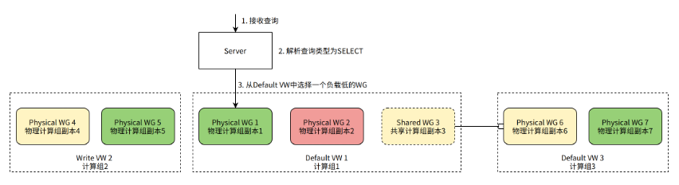
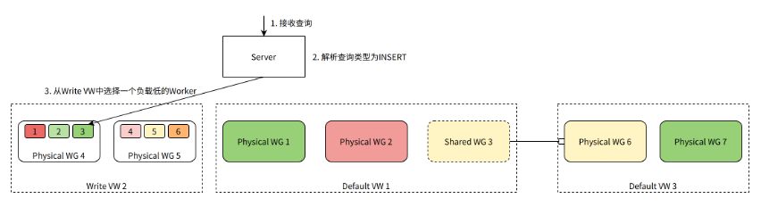

# 资源管理器

资源管理器（Resource Manager，简称 RM）组件用于对 ByConity 计算资源进行统一管理和调度，是实现资源弹性和提高资源利用率的核心组件。

## 目标

ByConity 资源管理器的核心设计目标如下：

1. 能够管理、调度计算资源，提升资源利用率。
2. 能够收集计算组 VW 的监控数据，便于基于负载进行资源调度。
3. 能够为查询、INSERT、各种后台任务提供调度功能。
4. 能够协调不同 VW 并动态调配 VW 的资源。
5. 实现资源池化，弹性扩缩功能。

## 计算资源的层级

为了实现上述目标，我们将计算资源进行层级化的划分和管理。

### 计算节点 Worker

在 [主要原理概念](../introduction/main-principle-concepts) 中我们知道 ByConity 计算资源中最小的计算单元是一个 Worker 节点，它对应一个 Kubenetes Pod。

Worker 启动后，将定期向 RM 汇报心跳信息，包括：

- 身份标识信息，如 WORKER_ID, WORKER_GROUP_ID, VIRTUAL_WAREHOUSE_ID 等。
- 节点物理负载信息，如 CPU 使用率、MEMORY 使用率等。
- 查询负载信息，如正在运行的 query 数量，排队的 query 数量等。

RM 维护和及时更新每个 Worker 的状态，在处理 query 时，根据 Worker 的身份标识和负载信息进行 query 的路由和调度。

### 计算组副本 Worker Group

计算组副本（Worker Group，简称 WG）是实际处理一个查询请求所使用的计算资源，它对应一个 Kubenetes StatefulSet。

一个计算组副本由多个 Worker 组成，每个 Worker 身份标识中的 WORKER_GROUP_ID 即指明自己所属的 Worker Group。同时，我们通过汇总 Worker Group 内所有 Worker 的负载信息，可以得到该 Worker Group 的聚合负载信息，如平均 CPU 使用率、最大 CPU 使用率、平均 MEMORY 使用率、最大 MEMORY 使用率等。

计算组副本又分为 Physical 和 Shared 两种。

- 物理计算组副本（Physical Worker Group）与一组实际的物理资源（Kubernetes StatefulSet）绑定。
- 共享计算组副本（Shared Worker Group）则不和物理资源绑定，而是通过引用的方式指向另一个 Physical Worker Group。Shared Worker Group 拥有独立的标识信息即 WOKRER_GROUP_ID，负载信息则为对应的 Physical Worker Group 的负载信息。

当我们需要管理（创建、删除等）一个物理计算组副本时，除了在 ByConity 内部修改元信息，还需要执行对应的 K8s 操作。而管理一个共享计算组副本则只需要修改该计算组副本的元信息即可，因为共享计算组副本不拥有任何物理资源。

### Virtual Warehouse

计算组（Virtual Warehouse，简称 VW）由多个配置相同的计算组副本构成。Worker 身份标识中的 VIRTUAL_WAREHOUSE_ID 即标识自己所属的 VW。

VW 分为两种类型：Default 和 Write。

- Default VW 负责处理用户的普通 SELECT 查询，Default VW 也称作 Read VW。
- Write VW 负责处理用户的 INSERT 查询，以及运行 ByConity 的 Merge、Mutate 等后台任务（link 后台任务）。

Default 和 Write VW 的区分，使得 ByConity 可以轻松实现读写分离，最大限度的保证查询性能。

## 调度流程

每一张 ByConity 用户表都需要指定自己的 default VW 和 write VW。之后，RM 会承担这张表的所有调度工作：SELECT query、INSERT query、后台任务等。

### SELECT Query 的调度流程

当 Server 发现 Query 是一个 SELECT Query 时，需要从表的 Default VW 中挑选一个 WG 来处理查询。

如图所示，假设表的 Default VW 中有 2 个 Physical WG，以及 1 个 Shared WG（指向另一个 VW 中的 Physical WG）。因为是一个 SELECT 查询，所以我们需要选择 1 个 WG 来处理查询。Physical WG 1 是当前负载最低的 WG，被选中处理该查询。

### INSERT Query 的调度流程

当 Server 发现 Query 是一个 INSERT Query 时，需要从表的 Write VW 中挑选一个 Worker 来处理查询。

如图所示，假设表的 Write VW 中有 2 个 Physical WG，每个 WG 包含 3 个 Worker。因为是一个 INSERT 查询，所以我们需要选择一个 Worker 来处理查询。Worker 3 当前负载最低，被选中处理该查询。

### 后台任务的调度流程

Server 除了处理用户查询，还需要为表调度后台任务，比如在后台不断地对表数据执行 Merge 以提升查询性能。

如图所示，Server 生成一个 Merge 任务，需要从 Write VW 中选择一个 Worker 来处理。Worker 3 当前负载最低，被选中来执行 Merge 任务。

## 高可用 & 兼容升级

1. 采用简单的多副本主从配置。
2. Worker 的心跳只发送给主节点，Server 的请求也只由主节点处理。
3. 当主节点宕机时，由备节点接替服务，并从 KV 数据库同步必要的元数据。
4. 由于 Server 有 VW、WG 和 Worker 信息的缓存，即便 RM 短时间不可用，服务节点仍然能够使用缓存的数据继续工作。

## 计算资源弹性共享

基于 Worker 负载信息对查询和后台任务进行调度，使得一个 VW 内部的 WG、Worker 负载更加均衡。此外，我们可以通过创建合适的 Shared WG（共享计算组）来实现 VW 之间的资源弹性共享。

当一个 Physical WG 整体资源利用率较低时，可以在其他需要更多计算资源的 VW 内创建一个 Shared WG，并指向该 Physical WG。这样，这个 Physical WG 就可以被其他 VW 的查询或任务所使用。

如图所示，在 Default VW 1 中，我们创建了一个共享计算组 Shared WG 3，它不拥有任何实际的物理计算资源，而是指向另一个 Default VW 3 中的物理计算组 Physical WG 6。Shared WG 3 拥有和 Physical WG 6 完全相同的负载信息，在 Default VW 1 进行调度决策时，可以选择 Shared WG 3（或其中的 Worker）来处理 SELECT 查询（或 INSERT 查询、后台任务）。最终，查询或后台任务实际是路由到 Physical WG 6 进行处理。

## 参考文档

[云原生数据仓库 ByteHouse 技术白皮书 V1.0](./assets/资源管理器/云原生数据仓库ByteHouse技术白皮书V1.0.pdf)
